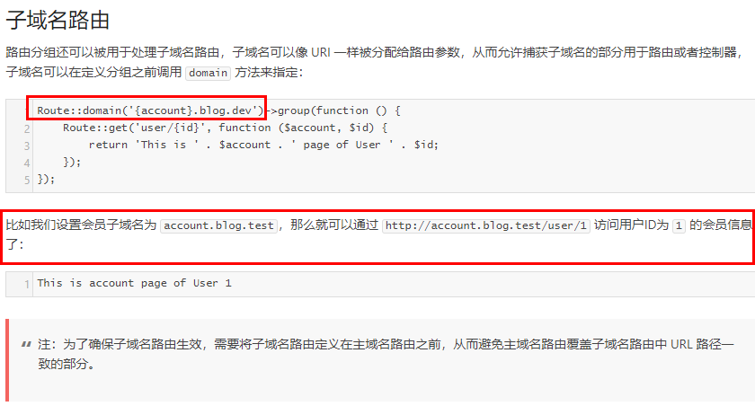

# 路由基础
## 1.自定义路由文件
````
namespace App\Providers;
//....
 public function map()
    {
        $this->mapTestRoutes();
    }
 protected function mapTestRoutes()
     {
         Route::middleware('web')
             ->namespace($this->namespace)
             ->group(base_path('routes/test.php'));
     }
//.....
------------------------------------test.php------------------------------------
 <?php
 /**
  * Create By: Will Yin
  * Date: 2020/7/24
  * Time: 11:12
  **/
use Illuminate\Support\Facades\Route;

 Route::get('test',function (){
     echo "this is test for route";
 });
````
post请求.需要CSRF认证,中间件就是``VerifyCsrfToken``这个类
````
namespace App\Http;

protected $middlewareGroups = [
        'web' => [
            \App\Http\Middleware\VerifyCsrfToken::class,
        ],

当注释了这个验证类就可以通过postman发送post请求而无需csrf校验
````
关于match方式
````
可以访问到第一个参数中所提供的所有的路由方法
Route::match(['get','post'],'url',function (){
    echo "this is will";
});
````
## 2.路由参数
````
# 通过 {名称}  就是路由参数,必选参数
Route::get('index/{age}',function(){
   echo $age;
});
# 参数之间使用 /
Route::get('index/{age}/{sex}',function($age,$sex){
  echo $age;
  echo $sex;
});
# 可选参数 {名称?}  
Route::get('index/{age?}',function($age=12){
   echo $age;
});
# 参数约束
Route::get('index/{age}',function($age=12){
   echo $age;
})->where('name','[A_Z]+');
# // 同时指定 id 和 name 的数据格式
Route::get('user/{id}/{name}', function ($id, $name) {
})->where(['id' => '[0-9]+', 'name' => '[a-z]+']);
````
路由的全局约束(定义再boot方法中)
````
每次执行一定会执行的方法

namespace App\Providers;
public function boot()
    {
        // * @method static void pattern(string $key, string $pattern)
        //父类中给出的约束
        Route::pattern('name','[a-c]+');
        parent::boot();
    }

此时路由中如果要传递参数name,那么一定要遵从这个全局约束
Route::get('test/{name}',function ($name){
    echo "the name is ".$name;
});
````
还可以为控制器动作指定路由名称：
````
Route::get('user/profile', 'UserController@showProfile')->name('profile');
这样我们就可以通过以下方式定义重定向：
Route::get('redirect', function() {
// 通过路由名称进行重定向
return redirect()->route('profile');
});
````
## 3.路由组
路由前缀
````
Route::prefix('admin')->group(function () {
    Route::get('user1', function () {
       echo "this 1";
    });
    Route::get('user2', function () {
           echo "this 2";
        });
    Route::get('user3', function () {
           echo "this 3";
        });
});
---------------------------------------加入别名机制---------------------------------------
这里给名字加个 . 方便区分 
Route::name('admin.')->group(function () {
    Route::get('user1', function () {
       echo "this is user1";
    })->name('user1');
    Route::get('user2', function () {
           echo "this 2";
        });
    Route::get('user3', function () {
           echo "this 3";
        });
});

Route::get('red', function() {
    return redirect()->route('admin.user1');
});
````


结合使用(路由组调用)
````
Route::group(['prefix'=>'admin','domain'=>'blog.com'],function(){
    Route::get('user1', function () {
        echo "this is user1";
    })->name('user1');
    Route::get('user2', function () {
        echo "this 2";
    });
});
````
路由中间件
````
创建中间件:
    php artisan  make:middleware  Test
编写中间件
    <?php
    namespace App\Http\Middleware;
    use Closure;
    class Test
    {
        /**
         * @param  \Illuminate\Http\Request  $request
         * @param  \Closure  $next 这里的Closure是一个闭包
         */
        public function handle($request, Closure $next)
        {
            //这里是中间的逻辑内容
            echo "this is test middlerware";
            //将所有的逻辑内容放置闭包内执行,一定要书写
            return $next($request);
        }
    }
注册中间件
    namespace App\Http\Kernel.php
    //..
    protected $routeMiddleware = [
            'test'=>Test::class,
        ];
    //....
使用
    Route::get('user2', function () {
        echo "this 2";
    })->middleware('test');
````


