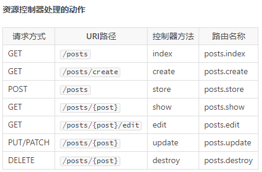
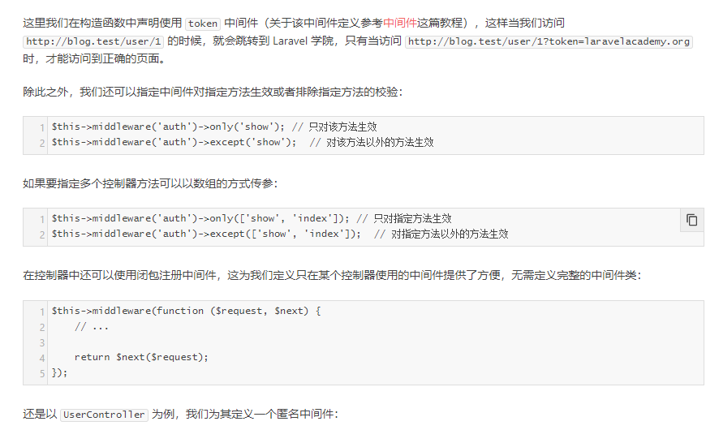
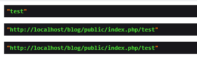
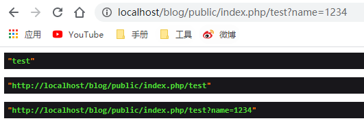
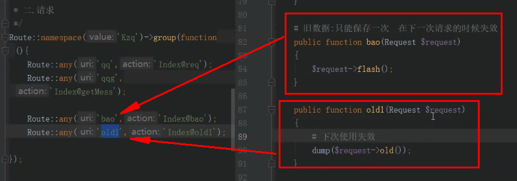

# 控制器基础
## 1.快速使用
快速创建控制器``php artisan make:controller /admin/WillController``

访问方式:
````
<?php
namespace App\Http\Controllers\admin;
use App\Http\Controllers\Controller;
use Illuminate\Http\Request;
class WillController extends Controller
{
    public function index()
    {
        echo "this is index";
     }
}
----------------------------------------路由----------------------------------------
Route::group(['namespace'=>'admin'],function(){
    Route::get('user2', 'WillController@index');
});
````
传参
````
public function index($name)
{
    echo "this is ".$name;
}

Route::group(['namespace'=>'admin'],function(){
    Route::get('user2/{$name}', 'WillController@index');
});
````
别名加传参
````
public function index($name)
{
    echo "this is ".$name;
}

Route::group(['namespace'=>'admin'],function(){
    Route::get('user2/{name}', 'WillController@index')->name('user');
});
Route::get('red',function(){
    return redirect()->route('user','will');
});
````
## 2. 单行控制器
快速创建``php artisan make:controller ShowProfile --invokable``

如果你想要定义一个只处理一个动作的控制器，可以在这个控制器中定义 __invoke 方法：
````
<?php
namespace App\Http\Controllers;
use App\User;
use App\Http\Controllers\Controller;

class ShowProfile extends Controller
{
    /**
     * 展示给定用户的个人主页          
     */
    public function __invoke($id)
    {
        return view('user.profile', ['user' => User::findOrFail($id)]);
    }
}

当你为这个单动作控制器注册路由的时候，不需要指定方法：
Route::get('user/{id}', 'ShowProfile');
````
## 3.资源控制器
快速创建``php artisan make:controller PostController --resource``

接下来，可以通过 resource 方法为该控制器注册一个资源路由：``Route::resource('posts', 'PostController');``

你可以通过传递数组到 resources 方法从而一次注册多个资源控制器：
````
Route::resources([
    'photos' => 'PhotoController',
    'posts' => 'PostController'
]);
````



## 3.请求
````
<?php
namespace App\Http\Controllers\admin;
use App\Http\Controllers\Controller;
use Illuminate\Http\Request;

class WillController extends Controller
{
    /**
     方式一 :直接new
     */
    protected $request;
    public function test()
    {
      $this->request = new Request();
      dd($this->request);
    }
    /**
    方式二:构造函数注入
     */
    public function __construct()
    {
      $this->request = new Request();
      dd($this->request);
     }
    public function test3(Request $request)
    {}
    /**
     方式三:依赖注入方式
     */
    public function test2(Request $request)
    {
        dd($request);
    }
}

````
请求路径 & 方法
````
--------------------------------------获取请求路径--------------------------------------
path 方法将会返回请求的路径信息，因此，如果请求URL是 http://domain.com/user/1，则 path 方法将会返回 user/1：

$path = $request->path();
--------------------------------------获取请求 URL--------------------------------------
想要获取完整的 URL，而不仅仅是路径信息，可以使用请求实例提供的 url 或 fullUrl 方法， url 方法返回不带查询字符串的 URL，而 fullUrl 方法返回结果则包含查询字符串：

// 不包含查询字符串
$url = $request->url();

// 不包含查询字符串
$url = $request->url()

// 包含查询字符串
$url_with_query = $request->fullUrl();

---------------------------------------使用-----------------------------------------
 public function index(Request $request)
    {
        dump($request->path());
        dump($request->url());
        dump($request->fullUrl());
     }
````




````
$name = $request->input('name',1234);#第二值是我们给默认值
$input = $request->only('username', 'password');
$input = $request->except('credit_card');
$input = $request->all();
````

## 4.[响应](https://xueyuanjun.com/post/19931.html)
````
public function res(){
 return [1,2,3]; #自动响应成数组的格式
 return response('this is response');
 return response()->json([1,3,3]); # 这种方式是不可以传递参数的
}
````
## 5.上传下载
路由文件
````
Route::post('sc', 'admin\WillController@sc');
Route::get('xz', 'admin\WillController@xz');
````
控制器
````
<?php

namespace App\Http\Controllers\admin;

use App\Http\Controllers\Controller;
use Illuminate\Http\Request;

class WillController extends Controller
{
    /**
     图片的上传
     */
    public function sc(Request $request)
    {
       $file = $request->file('filename');
        //dump($file->path());#打印出文件的上传地址
        //dump($file->isValid());#判断是否为有效文件
        //dump($file->store('image'));#将文件存储在storage/image目录下
        dump($file->storeAs('image','test.png'));#将文件存储在storage/app/image目录下并取名为test.png

      }

    //图片的下载
   public function xz()
   {
     $file = 'app/image/test.png';
     return response()->download(storage_path($file));
   }
}
````
修改目录存储路径,修改config中``filesystems.php``
````
'disks' => [

        'local' => [
            'driver' => 'local',
            //'root' => storage_path('app'),
            'root' => public_path(),
        ],

        'public' => [
            'driver' => 'local',
            //'root' => storage_path('app/public'),
            'root' => public_path(),
            'url' => env('APP_URL').'/storage',
            'visibility' => 'public',
        ],
        //.....

    ],
````
控制器
````
<?php
namespace App\Http\Controllers\admin;
use App\Http\Controllers\Controller;
use Illuminate\Http\Request;
class WillController extends Controller
{
    /**
     图片的上传
     */
    public function sc(Request $request)
    {
       $file = $request->file('filename');
        //dump($file->path());#打印出文件的上传地址
        //dump($file->isValid());#判断是否为有效文件
        //dump($file->store('image'));#将文件存储在storage/image目录下
        dump($file->storeAs('image','test.png'));#将文件存储在storage/app/image目录下并取名为test.png
      }

    //图片的下载
    public function xz()
    {
      $file = 'image/test.png';
      return response()->download(public_path($file));
    }
}
````
