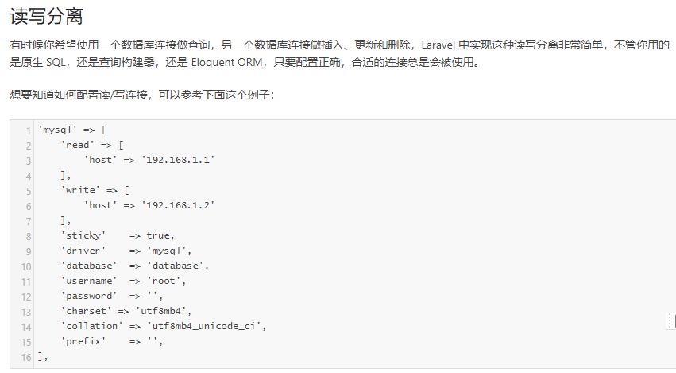
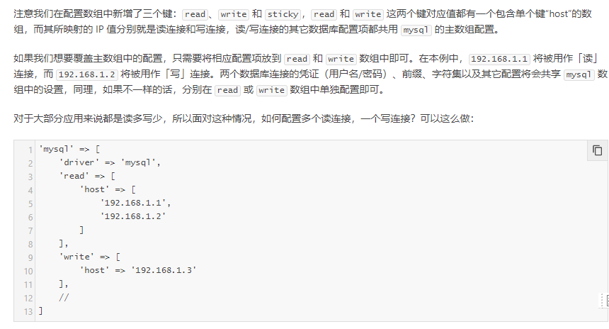
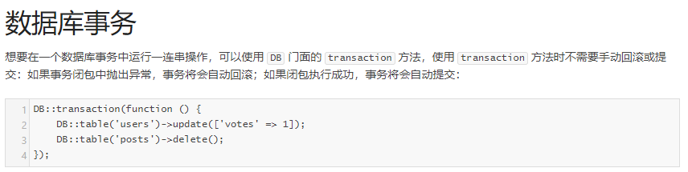

# 数据库基础
````
进行所有sql语句的打印,在App\Providers\AppServiceProvider.php的boot方法中添加以下内容

public function boot()
{
    Schema::defaultStringLength(191);
    Db::listen(function($query){
        dump($query->sql);
    });
}


控制器中就可以执行 DB::table('will')->find(1);
````


##  1.关于数据迁移错误
``Illuminate\Database\QueryException  : SQLSTATE[42000]: Syntax error or access violation: 1071 Specified key was too long; max k
ey length is 1000 bytes (SQL: alter table `users` add unique `users_email_unique`(`email`))``

这是因为字符集的问题
````
config/database.php

'mysql' => [
   //...
            'charset' => 'utf8mb4',  //这种字符集每个字节占8个字节长度
   //.....
        ],

解决:
    可以手动将其修改成为 utf8

    另一种方式就是手动修改长度
        namespace App\Providers\AppServiceProvider.php种

         public function boot()
        {
            Schema::defaultStringLength(191);
        }
````
自定义迁移文件``php artisan make:migration create_will_table``
````
 Schema::create('will', function (Blueprint $table) {
            $table->bigIncrements('id');
            $table->string('name');
            $table->timestamps();
            $table->integer('votes');
            $table->engine = 'InnoDB';
        });

执行命令 : php artisan migrate
````
迁移文件执行的是每个迁移文件中的up方法

回滚执行的是down方法,可以在down总写逻辑,然后执行命``php artisan  migrate:rollback ``
## 2.利用填充文件快速填充数据
快速创建填充文件``php artisan make:seeder WillTableSeeder``
````
<?php
use Illuminate\Database\Seeder;
use Illuminate\Support\Facades\DB;
class WillTableSeeder extends Seeder
{
    public function run()
    {
        DB::table('will')->insert([
            'name' => md5(rand(1,10)),
            'votes' => mt_rand(10,1000),
        ]);
    }
}
````
在``database/seeds/DatabaseSeeder.php``调用对应的填充文件
````
<?php
use Illuminate\Database\Seeder;
class DatabaseSeeder extends Seeder
{
    public function run()
    {
         $this->call(WillTableSeeder::class);
    }
}
````
执行填充``php artisan db:seed (--class=WillTableSeeder)``
````
D:\phpstudy\phpstudy_pro\WWW\blog>php artisan db:seed --class=WillTableSeeder
"insert into `will` (`name`, `votes`) values (?, ?)"
Database seeding completed successfully.
````
## 3.分页与事务
````
$res = DB::table('will')->paginate(2);
return view('index',['res'=>$res]);

视图中调用
@foreach($res as $val)
{{$val->name}} //..
@endforeach

调用分页的方法
{{$res->links()}}
````
注意事务的表引擎必须为innodb


````
DB::beginTransaction();
        $sql = DB::table('t_admin')->where('id',144)->delete();
        $sql2 = DB::table('t_icode')->where('id',123)->delete();
        if ($sql&&$sql2){
        //如果语句执行成功就进行提交
            DB::commit();
            return success;
        }else{
        //如果失败就回滚
            DB::rollback();
            return error;
        }

或者
DB::beginTransaction();
    try{
        $sql = DB::table('t_admin')->where('id',144)->delete();
        $sql2 = DB::table('t_icode')->where('id',123)->delete();
        DB::commit();
        return success;
    }catch(\Exception $e){
        DB::rollback();
        return error;
    }
````


