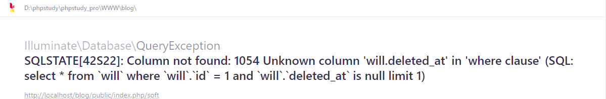
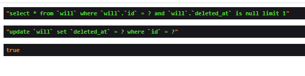
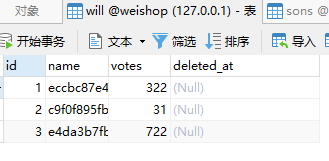
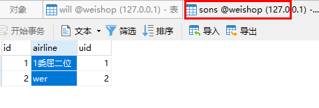
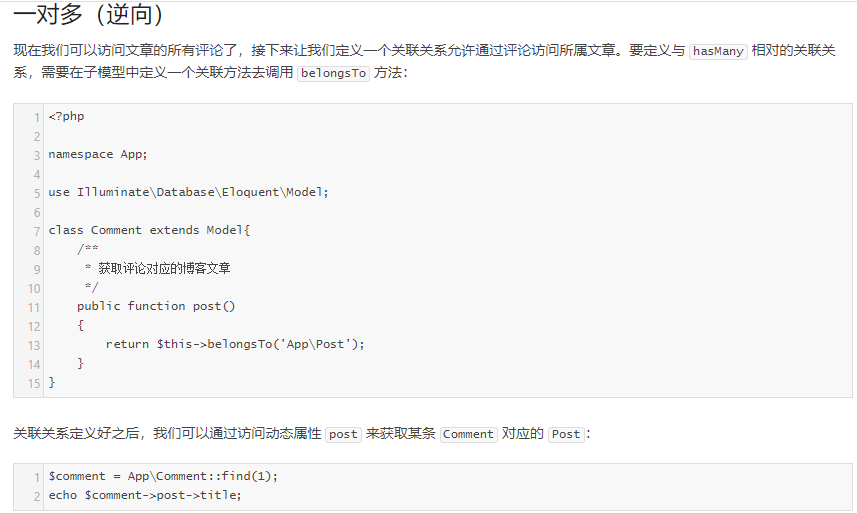
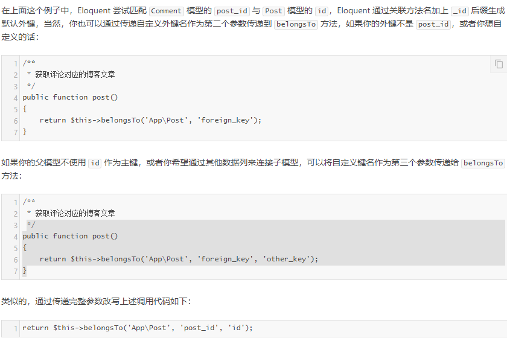
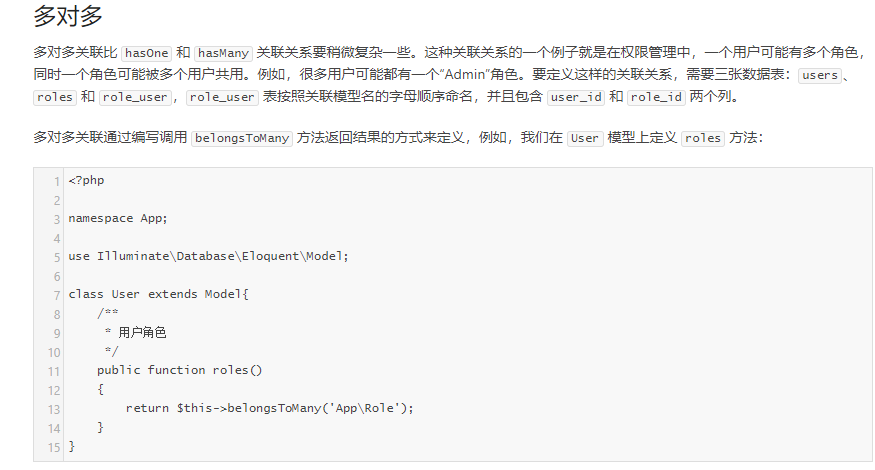
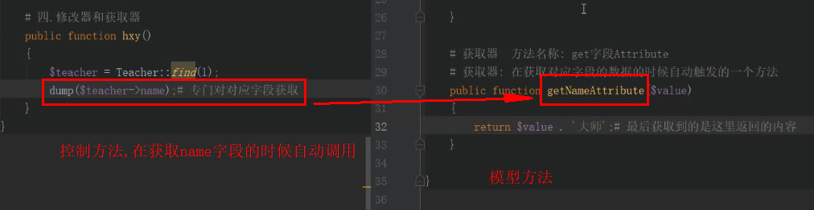
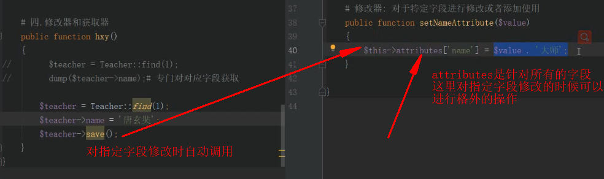

# 数据库模型
## 1.快速使用
``php artisan make:model Models/Will``

同时生成数据库迁移文件``php artisan make:model Flight -m``

````
---------------------------------------模型内容---------------------------------------
<?php

namespace App\Models;

use Illuminate\Database\Eloquent\Model;

class Will extends Model
{
    #设置连接的数据库
    protected $connection = "mysql_products";

    #laravel 属性类型转换$casts
     protected $casts = [
        'is_directory' => 'boolean',
     ];
    
    #注意我们并没有告诉 Eloquent 我们的 Flight 模型使用哪张表，默认规则是小写的模型类名复数格式作为与其
    #对应的表名（除非在模型类中明确指定了其它名称）。所以，在本例中，Eloquent 认为 Flight 模型存储记录
    #在 flights 表中。你也可以在模型中定义 table 属性来指定自定义的表名
    protected $table = 'will';

    #Eloquent 默认每张表的主键名为 id，你可以在模型类中定义一个 $primaryKey 属性来覆盖该约定：
    protected $primaryKey = 'id';

    #如果你想要使用非自增或非数字类型主键，必须在对应模型中设置 $incrementing 属性为 false：
    #public $incrementing = false;

    #如果主键不是整型，还要设置 $keyType 属性值为 string：
    #protected $keyType = 'string';

    #默认情况下，Eloquent 期望 created_at 和 updated_at 已经存在于数据表中，如果你不想要这些 Laravel 自动管理的数据列，在模型类中设置 $timestamps 属性为 false：
    public $timestamps = false;

    #如果你想要定义某些模型属性的默认值，可以在模型上定义 $attributes 属性
    protected $attributes = [
        'name' => 'will',
    ];

     #还可以使用 create 方法保存一个新的模型。该方法返回被插入的模型实例。但是，在此之    #前，你需要指定模型的 fillable 或 guarded 属性，因为所有 Eloquent 模型都通过批
     #量赋值（Mass Assignment）进行保护，这两个属性分别用于定义哪些模型字段允许批量赋
     #值以及哪些模型字段是受保护的，不能显式进行批量赋值
     #所以，你应该在模型中定义哪些属性是可以进行赋值的，使用模型上的 $fillable 属性即
     #  可实现。例如，我们设置 Flight 模型上的 name 属性可以被赋值：
     protected $fillable = ['name'];

    #$fillable 就像是可以被赋值属性的“白名单”，还可以选择使用 $guarded。$guarded 属
    #性包含你不想被赋值的属性数组。所以不被包含在其中的属性都是可以被赋值的，因此，
    #$guarded 功能就像“黑名单”。当然，这两个属性你只能同时使用其中一个而不能一起使用，
    #因为它们是互斥的。下面的例子中，除了 price 之外的所有属性都是可以赋值的：
     protected $guarded = ['price'];

    #默认情况下，Eloquent 预期你的数据表中存在 created_at 和 updated_at 。如果你不想让 Eloquent 自动管理这两个列， 请将模型中的 $timestamps 属性设置为 false：
     public $timestamps = false;
}
---------------------------------------控制器调用---------------------------------------
<?php

namespace App\Http\Controllers\admin;
use App\Http\Controllers\Controller;
use Illuminate\Http\Request;
use App\Models\Will as Will;
use SebastianBergmann\CodeCoverage\Report\PHP;

class WillController extends Controller
{
    //增加的操作
    public function index()
    {
       #insert返回真假
       $flights = Will::insert(['name'=>'will']);
       #在新增的同时获取它的id,create返回对象
       $flights = Will::create(['name'=>'will'])->id;
    }

    //查询的操作
    public function all()
    {
        $flights = Will::all();
        foreach ($flights as $flight) {
            echo $flight->name;
            echo PHP_EOL;
        }
   }
    public function all()
    {
        $flights = Will::where('id','>',3)->get();
        #获取一条数据
        $flights = Will::where('id',3)->get();
        $flights = Will::find(1);
   }
    public function index()
    {
       $flights = Will::where('name', 'eccbc87e4b5ce2fe28308fd9f2a7baf3')
                      ->orderBy('name', 'desc')
                      ->take(10)
                      ->get();
   }
   
    #修改的操作
     public function index()
    {
       $flights = Will::where('id',2)->update(['name'=>'will']);
   }
  
    #删除操作
    $res = Will::find(5);
    $res->delete();
}
````
## 2.软删除
需要在模型中引入`` use SoftDeletes;``
````
<?php
namespace App\Http\Controllers\admin;
use App\Http\Controllers\Controller;
use Illuminate\Http\Request;
use App\Models\Will as Will;
use SebastianBergmann\CodeCoverage\Report\PHP;

class WillController extends Controller
{
    public function soft()
    {
        $flights = Will::find(1);
        dump($flights->delete());
        #软删除的数据正常查询不到,"select * from `will` where `will`.`deleted_at` is null"
         dump( Will::all());
        #查询所有的数据,"select * from `will`"
         dump(Will::withTrashed()->get());
        #只查看软删除数据,"select * from `will` where `will`.`deleted_at` is not null"
        dump(Will::onlyTrashed()->get());
   }
}

Route::get('soft','admin\WillController@soft');
````



>报错是因为没有``deleted_at``字段



进行软删除的恢复,"update `will` set `deleted_at` = ? where `will`.`deleted_at` is not null"
````
Will::onlyTrashed()->restore()
````
强制删除带where条件
````
Will::onlyTrashed()->where('id','<',6)->forceDelete();
````
## 3.关联查询
主表



子表



### 3.1一对一关联
````
主表关联子表

public function Son(){
     #return $this->hasOne(Son::class,'uid','id');
     return $this->hasOne('App\Models\Son','uid','id');
    }

调用方式
use App\Models\Will as Will;

 $res = Will::find(2);
 dump($res->son->airline);

-----------------------------------------------------
子表关联主表

public function Will(){
     return $this->belongsTo(Will::class,'uid','id');
     return $this->hasOne('App\Models\Will','uid','id');
    }

调用方式
use App\Models\Son as Son;

 $res = Son::find(2);
 dump($res->will->name);
````
>这种方式只能是一条对应一条
### 3.2一对多关联
````
主表关联子表
public function Son(){
        return $this->hasMany(Son::class,'uid','id');
        return $this->hasMany('App\Models\Son','uid','id');
    }

调用方式
use App\Models\Will as Will;

public function soft()
    {
        $res = Will::find(1);
        foreach ($res->son as $val) {
            $arr[] = ($val->airline);
        }
        var_dump($arr);
    }
````
反向关联




>注意不要忽略了``return``这个参数
### 3.3 多对多

## 4.获取器和修改器
获取器



修改器(对字段进行写操作的时候都会自动调用)

