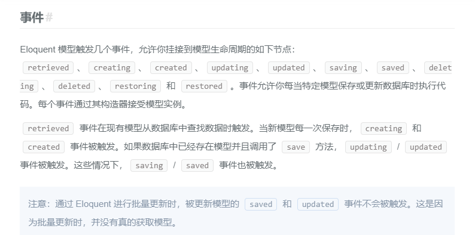

# 表单验证
## 1.观察者
创建观察者"``php artisan make:observer WillObserver --model=Models\Will``

注册观察者:
````
App\Providers\AppServiceProvider.php中

Will::observe(WillObserver::class);

----------------------------------------------------
<?php
use App\Observers\WillObserver;
use App\Models\Will as Will;

class AppServiceProvider extends ServiceProvider
{
   //......
    public function boot()
    {
        //修改因编码方式的的长度限制
        Schema::defaultStringLength(191);
        //打印出执行的sql语句
        \Illuminate\Support\Facades\DB::listen(function($query){
            dump($query->sql);
        });
        //注册观察者
        Will::observe(WillObserver::class);
    }
}

````
使用观察者:



````
观察中的方法(查询就会执行):
    public function retrieved()
    {
        dump('初始化执行的方法');
    }

控制器中调用
    public function soft()
    {
        Will::find(1);
    }

------------------------------------------------------
观察中的方法(新增就执行):
    public function created(Will $will)
    {
        dump('执行了数据的添加');
    }

    public function soft()
    {
        //使用insert新增是不会执行created方法的
        dump(Will::insert(['name'=>'yin']));
    }
    public function soft()
    {
        //使用insert新增是不会执行created方法的,但是会报错
        dump(Will::create(['name'=>'yin']));
    }
````


模型中加入`` public $fillable=['name'];``即可

观察者适合做一些订单任务或者时日志的写入等操作
## 2.cookie和session
cookie
````
设置cookie
    $res = Cookie::make('name','will',60);
    return response('添加了cookie')->cookie($res);
获取cookie
    return \request()->cookie('name');
    return Cookie::get('name');
删除cookie
    return Cookie::forget('name');
````


[session](https://learnku.com/docs/laravel/6.x/session/5143)
````
设置session

获取session
    $value = $request->session()->get('key');//获取单个session
    $data = $request->session()->all();//获取所有的session
    $request->session()->exists('users')//判断是否存在
删除session
    $request->session()->forget('key');//删除单个值
    $request->session()->forget(['key1', 'key2']);//删除多个值
    $request->session()->flush();//删除所有
````
## 3.[表单验证](https://learnku.com/docs/laravel/6.x/validation/5144)
````
$request->validate([
    'title' => 'required|unique:posts|max:255',
    'body' => 'required',
    'publish_at' => 'nullable|date',
]);
````


创建表单请求验证
````
php artisan make:request WillPost

修改权限
    public function authorize()
    {
       // return false;
        return true;
    }
指定规则
    public function rules()
    {
        return [
                                 //数据库的操作
            'title' => 'required|unique:posts|max:255',
            'body' => 'required',
        ];
    }
````


## 4.错误及错误日志
