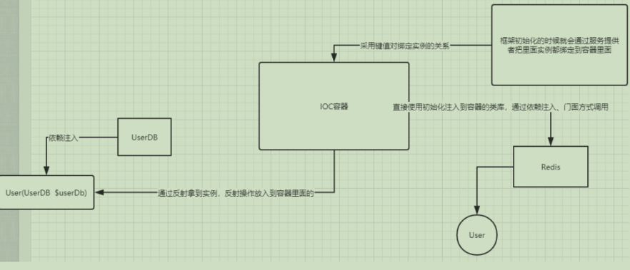
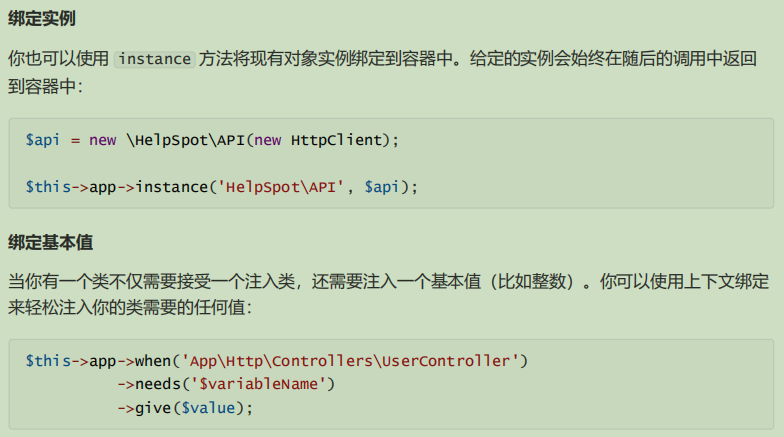
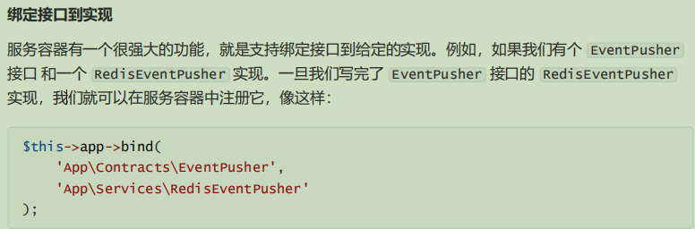
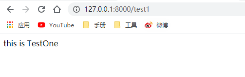
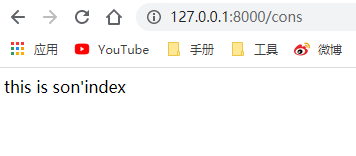

# 核心服务
## 1.容器
### 1.1  IOC 概念
DI叫 依赖注入 , 是IoC的一种实现方式

IoC叫 控制反转 ，是 Inversion of Control 的缩写，它不是什么技术，而是一种设 计思想。Ioc意味着将你设计好的对象交给容器控制，而不是传统的在你的对象内部直接控制(例：对象内部在实例化对象)。通过容器来实现对象组件的装配和管

>个人理解
````
控制反转
    控制:
        控制资源的获取,控制对象的生成
    反转:
        正转:要什么就去拿
        反转:我要什么,别人提供给你

IoC 体现了 好莱坞原则 – “Don’t call me, we will call you”。
````

### 1.2 IoC的优缺点
#### 优点：
- 容器可以自动对你的代码进行初始化，资源集中管理，实现资源的可配置和易管理。
- 降低了使用资源双方的依赖程度，也就是我们说的耦合度。
- 创建实例的时候不需要了解其中的细节。
#### 缺点：
- 创建对象的步骤变复杂了，不直观，当然这是对不习惯这种方式的人来说的。
- 因为使用反射来创建对象，所以在效率上会有些损耗。但相对于程序的灵活性和可维护性来说，这点损耗是可以接受的。
## 2.服务提供者
服务就是为使用者提供某一项功能。例如：你购买手机后，手机商会提供一个售后服务，这里面就体现
了服务。而在容器里面的操作类库，就是由相关的服务提供的
## 2.1 服务的绑定
#### 简单绑定
在服务提供者中，你总是可以通过 $this->app 属性访问容器。我们可以通过容器的 bind 方法注册
绑定， bind 方法的第一个参数为要绑定的类 / 接口名，第二个参数是一个返回类实例的 Closure ：
````
$this->app->bind('HelpSpot\API', function ($app) {
    return new \HelpSpot\API($app->make('HttpClient'));
});
````
注意，我们接受容器本身作为解析器的参数。然后，我们可以使用容器来解析正在构建的对象的子依
赖。
#### 绑定一个单例
singleton 方法将类或接口绑定到只解析一次的容器中。一旦单例绑定被解析，相同的对象实例会在随后的调用中返回到容器中：
````
$this->app->singleton('HelpSpot\API', function ($app) {
    return new \HelpSpot\API($app->make('HttpClient'));
});
````


### 2.2 解析实例
#### make 方法
你可以使用 make 方法从容器中解析出类实例。 make 方法接收你想要解析的类或接口的名字：
````
$api = $this->app->make('HelpSpot\API');
````
#### resolve 方法
如果你的代码处于无法访问 $app 变量的位置，则可用全局辅助函数 resolve 来解析
````
$api = resolve('HelpSpot\API');
````
### 2.3 服务提供者
服务提供者是所有 Laravel 应用程序的引导中心。你的应用程序，以及 通过服务器引导的 Laravel 核心
服务都是通过服务提供器引导。

但是，「引导」是什么意思呢？
>当你打开 Laravel 的 ``config/app.php`` 文件时，你会看到 providers 数组。数组中的内容是应用程序要加载的所有服务提供者的类。当然，其中有很多 「延迟」 提供者，他们并不会在每次请求的时候都加载，只有他们的服务实际被需要时才会加载。
#### 2.3.1 编写服务提供者
>所有的服务提供者都会继承 ``Illuminate\Support\ServiceProvider`` 类。 大多服务提供者都包含一个 ``register`` 和一个 ``boot`` 方法。在 register 方法中， 你只需要将服务绑定到服务容器。而不要尝试在 register 方法中注册任何监听器，路由，或者其他任何功能

创建服务
````
<?php
namespace App\Units\Test;

//模拟一个服务提供者
class TestOne{

  public function index(){
        echo "this is TestOne";
   }

}
````
创建服务提供者
````
php artisan make:provider WillServiceProvider
````
注册方法(服务)
>如上所述，在 register 方法中，你只需要将服务绑定到服务容器中。而不要尝试在 register 方法中注册任何监听器，路由，或者其他任何功能。否则，你可能会意外地使用到尚未加载的服务提供者提供的服务
>
>``在任何服务提供者方法中，你总是通过 $app 属性来访问服务容器``
````
<?php
namespace App\Providers;
use App\Units\Test\TestOne;
use Illuminate\Support\ServiceProvider;

class WillServiceProvider extends ServiceProvider
{

    public function register()
    {
       $this->app->singleton('TestOne',function (){
             return new TestOne();
       });
    }

    public function boot()
    {
        //
    }
}
````
绑定服务提供者(config.php\app.php)
````
 'providers' => [
    //...
        App\Providers\WillServiceProvider::class,
    //...
    ],
````
使用
````
<?php
Route::get('test1',function (){
   //使用app调用,这里名称是服务提供者 register() 方法绑定的名称
    return app('TestOne')->index();
});
````

## 3.门面使用
>Facades 为应用的 服务容器 提供了一个「静态」 接口。Laravel 自带了很多 Facades，可以访问绝大部分功能。Laravel Facades 实际是服务容器中底层类的 「静态代理」 ，相对于传统静态方法，在使用时能够提供更加灵活、更加易于测试、更加优雅的语法。
### 3.1 Facades 使用
所有的 Laravel Facades 都定义在 Illuminate\Support\Facades 命名空间下。所以，我们可以轻松的使用 Facade 
````
use Illuminate\Support\Facades\Cache;
    
Route::get('/cache', function () {
    return Cache::get('key');
});
````
### 3.2 Facades 工作原理
在 Laravel 应用中，Facade 就是一个可以从容器访问对象的类。其中核心的部件就是 Facade 类。不管是 Laravel 自带的 Facades，还是自定义的 Facades，都继承自``Illuminate\Support\Facades\Facade``类。Facade 基类使用了 __callStatic() 魔术方法，直到对象从容器中被解析出来后，才会进行调用,所有在``config.php\app.php中的aliases方法内的门面类都可以直接使用``
````
namespace Illuminate\Support\Facades;
abstract class Facade
{
    public static function __callStatic($method, $args)
    {
        $instance = static::getFacadeRoot();
        if (! $instance) {
            throw new RuntimeException('A facade root has not been set.');
        }
        return $instance->$method(...$args);
    }
 }

````
### 3.3 自定义门面
创建门面要代理的类
````
<?php
namespace App\Units\Faced;
//这里要继承总的门面类
use Illuminate\Support\Facades\Facade;

class TestFace extends Facade{
   
    public static function getFacadeAccessor(){
        //这里的名字一定要和服务提供者中中定义的名字相同
        return 'TestOne';
   }
}
````
注册门面(服务提供者要先注册好)
````
 'providers' => [
    //...
        App\Providers\WillServiceProvider::class,
    //...
    ],

'aliases' => [
    //...
        'TestOne' => App\Units\Faced\TestFace::class,
    //...
    ],
````
调用
````
<?php
Route::get('face',function (){
    //发现这种调用方式更加优雅一些
    return TestOne::index();
});
````
## 4.契约
>契约就是接口，它的使用就是把方法中的参数类型约束设置为接口，但实际传参 的时候，用的是实例化接口的类

>Laravel 中的许多类都通过服务容器解析，包括控制器，事件监听器，中间件，队列任务，甚至路由闭包。因此，要获得契约的接口实现，你可以在要解析的类的构造函数中使用「类型提示」接口
````
<?php
namespace App\Listeners;
use App\Events\OrderWasPlaced;
use App\User;
use Illuminate\Contracts\Redis\Factory;
class CacheOrderInformation
{
    protected $redis;
                               //这里对传入对象的类型约束Factory 实则就是一个接口
    public function __construct(Factory $redis)
    {
        $this->redis = $redis;
    }
}
````
### 4.1 自定义契约
创建契约(接口)
````
<?php
namespace App\Units\Cons;

interface Father
{
  public function index();
}
-------------------------------子类实现接口-------------------------------
<?php
namespace App\Units\Cons;

class Son implements Father {
    public function index(){
        echo "this is son'index";
    }
    
    public function test()
    {
        echo "this is son'test";
    }
}
````
创建服务提供者并进行服务绑定
````
php artisan make:provider ConsServiceProvider

--------------------------------------------服务提供者--------------------------------------------
<?php
namespace App\Providers;
use App\Units\Cons\Father;
use App\Units\Cons\Son;
use Illuminate\Support\ServiceProvider;

class ConsServiceProvider extends ServiceProvider
{
    public function register()
    {
      $this->app->singleton(Father::class,Son::class);
    }

    public function boot()
    {

    }
}
````
注册服务提供者(config.php/app.php)
````
'providers' => [
    //..
        App\Providers\ConsServiceProvider::class,
    //...
    ],
````
测试
````
Route::get('cons',function (\App\Units\Cons\Father $father){
    return $father->index();
});
````


