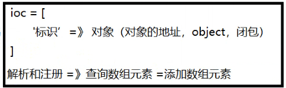
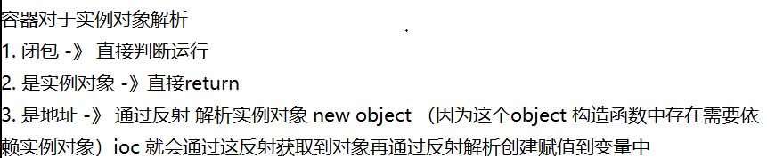

# 手写laravel之了解IOC(控制反转)和DI(依赖注入)
## 1.快速通俗理解IOC(控制反转)和DI(依赖注入)
(帮助文档 : https://www.jianshu.com/p/173ac2f78453)

在大城市漂泊了多年,你有了自己的积蓄,想要有自己的房子,想要自己盖房子（自己“控制”房子）,但是盖房子的过程十分的麻烦,所有你想购房,就找了房产中介（IOC容器）买了房子（依赖注入）,这样你就住上了自己的房子.

你 依赖 房子，你自己盖房子（自己“控制”房子）到找中介买房子（让中介“控制”房子），这就叫做控制反转，也就是IOC；而房产中介根据你的需求，直接把房子提供给你（当然你付钱了），这就叫做依赖注入，也就是DI。

当然，这个房子并不是房产中介建设的，而是开发商建设的，这个``开发商就是服务提供者``。

若干年，你的房子因为各种原因，住得不舒服，想改造/重新装修房子，但是时间成本太高了，于是，你又找房产中介买了房子，你又很快住上新房子了。。。这也体现了面向对象中类的单一职责原则。

采用IOC思想和DI设计模式，主要目的是：解耦


### 1.1 原生代码实现
````
class 购房者
{
    private $姓名;

    public function __construct($姓名)
    {
        $this->姓名 = $姓名;
    }

    public function 买房()
    {
        //这里每次调用都要对商品房进行new操作
        $新房 = new 商品房('0001', '四室两厅', '180平方米');

        echo '我是'.$this->姓名."\r\n";
        echo '我买了'. $新房->获取户型(). '的房子了'."\r\n";
        echo '面积是'. $新房->获取面积(). "\r\n";
    }

}
class 商品房
{
    private $房源编号;
    private $户型;
    private $面积;

    public function __construct($房源编号, $户型, $面积)
    {
        $this->房源编号 = $房源编号;
        $this->户型 = $户型;
        $this->面积 = $面积;
    }

    public function 获取面积()
    {
        return $this->面积;
    }

    public function 获取户型()
    {
        return $this->户型;
    }
}

$will = new 购房者('will');
$will->买房();
-----------------------------------------------结果:---------------------------------------------
[root@localhost ~]# php 1.php
我是will
我买了四室两厅的房子了
面积是180平方米
````
>存在问题:代码的更新/重新调用时便随着大量的内容的修改
### 1.2 采用IOC和DI的思想来实现
````
<?php

class 购房者
{
    private $姓名;

    public function __construct($姓名)
    {
        $this->姓名 = $姓名;
    }

    public function 买房($新房)
    {
        echo '我是'.$this->姓名."\r\n";
        echo '我买了'. $新房->获取户型(). '的房子了'."\r\n";
        echo '面积是'. $新房->获取面积()."\r\n";
    }

}
class 商品房
{
    private $房源编号;
    private $户型;
    private $面积;

    public function __construct($房源编号, $户型, $面积)
    {
        $this->房源编号 = $房源编号;
        $this->户型 = $户型;
        $this->面积 = $面积;
    }

    public function 获取面积()
    {
        return $this->面积;
    }

    public function 获取户型()
    {
        return $this->户型;
    }
}

//这里出现一个中间商,来注册管理我们的购买者信息以及房源信息
// ioc容器
class 中间商 
{
    //
    protected $用户信息 = [];
   
    //将所有的房源信息进行注册
    protected $房源信息 = [];
    /*
    注册公司 、 注册实例对象
     */
    public function bind($户型,$商品房) // 注册
    {
        $this->房源信息[$户型] = $商品房;
    }
    /*
    从实例对象中解析
     */
    public function make($户型) // 解析
    {
        return $this->房源信息[$户型];
    }
}

//进行信息的注入
$商品房1 = new 商品房('0001', '四室两厅', '180平方米');
$商品房2 = new 商品房('0002', '两室一厅', '100平方米');
$ioc = new 中间商;
$ioc->bind('四室两厅',$商品房1);
$ioc->bind('180平方米',$商品房1);
$ioc->bind('两室一厅',$商品房2);
$ioc->bind('100平方米',$商品房2);

$购房者 = new 购房者('will');
$购房者->买房($ioc->make('180平方米'));

----------------------------------------------------结果----------------------------------------------------
[root@localhost ~]# php 1.php 
我是will
我买了四室两厅的房子了
面积是180平方米
````
>ioc的本质就是通过一个数组或集合的方式对于框架及项目中所有运行的实例对象,进行一个统一的管理,在ioc容器的实例对象中会存在``bind``和``make``方法对容器进行操作,这样有利与代码的拓展/后期维护以及复用
>
>就是把new的实例对象绑定在数组中进行获取,配合DI方法中的约束类型进行依赖注入
## 2.理解依赖注入

````
-------------------------------------------App/Father.php-------------------------------------------
<?php
namespace App;

class Father{

    public function __construct()
    {
        echo "this is father\n";
     }

    public function index(){
         echo "this is the test for DI\n";
    }
}
-------------------------------------------App/Son.php-------------------------------------------
<?php
namespace App;
use App\Father;

class Son{

    protected $con;
    //这里的Father相对于Son就是一个依赖的注入
    public function __construct(Father $con)
    {
        $this->con = $con;
        echo "this is son\n";
    }
  public function index(){
         //这里没有new的过程就可以直接调用方法
         $this->con->index();
   }
}
-------------------------------------------App\Providers\AppServiceProvider-------------------------------------------
//...
 public function boot()
    {
        $this->app->singleton('son',\App\Son::class);
    }
//..
-------------------------------------------路由中调用-------------------------------------------
Route::get('son', function () {
    return app()->make('son')->index();
});


结果:
this is father 
this is son 
this is the test for DI
````
## 3.理解laravel容器
````
//首先是这个获取所有绑定容器的方法
    public function getBindings()
    {
        return $this->bindings;
    }
````
 通过app调用该方法可以获取所有的容器信息
````
Route::get('test', function () {
   dd(app()->getBindings());
});
````
绑定的过程
````
//绑定的属性
     protected $bindings = [];
//最后是绑定的方法
     public function bind($abstract, $concrete = null, $shared = false)
        {
            //删除陈旧实例
            $this->dropStaleInstances($abstract);
    
            //如果没有指定具体类型，我们只需将具体类型设置为
            //抽象类型。之后，将注册为共享的具体类型
            //而不必在两个参数中声明它们的类。
            if (is_null($concrete)) {
                $concrete = $abstract;
            }
            
            //判断是否未闭包
            if (! $concrete instanceof Closure) {
                //设置未闭包实例
                $concrete = $this->getClosure($abstract, $concrete);
            }
            //注册设置
            $this->bindings[$abstract] = compact('concrete', 'shared');
    
           //如果抽象类型已在此容器中解析，则将激发
            if ($this->resolved($abstract)) {
                $this->rebound($abstract);
            }
        }
````
下面看是如何解析的
````
    public function make($abstract, array $parameters = [])
    {
        //调用了resolve方法
        return $this->resolve($abstract, $parameters);
    }

   //查找到resolve方法
    protected function resolve($abstract, $parameters = [], $raiseEvents = true)
    {
        $abstract = $this->getAlias($abstract);
        
        $needsContextualBuild = ! empty($parameters) || ! is_null(
            $this->getContextualConcrete($abstract)
        );

        if (isset($this->instances[$abstract]) && ! $needsContextualBuild) {
            return $this->instances[$abstract];
        }
        
        $this->with[] = $parameters;
        
        $concrete = $this->getConcrete($abstract);
        

        if ($this->isBuildable($concrete, $abstract)) {
           //重点关注
            $object = $this->build($concrete);
        } else {
            //这里直接递归了
            $object = $this->make($concrete);
        }

        foreach ($this->getExtenders($abstract) as $extender) {
             //重点关注
            $object = $extender($object, $this);
        }
        
        if ($this->isShared($abstract) && ! $needsContextualBuild) {
            $this->instances[$abstract] = $object;
        }
        
        if ($raiseEvents) {
            $this->fireResolvingCallbacks($abstract, $object);
        }
    
        $this->resolved[$abstract] = true;
        
        array_pop($this->with);
        
        return $object;
    }

    //个可以看到它的所有操作都依赖于 $concrete 这个属性
    public function build($concrete)
    { //..   }

    //那我们就重点关注下这个属性
     protected function resolve($abstract, $parameters = [], $raiseEvents = true)
        {
            //..
    
            $needsContextualBuild = ! empty($parameters) || ! is_null(
                $this->getContextualConcrete($abstract)
            );
            //...
            $concrete = $this->getConcrete($abstract);
            //...
     }

    protected function getConcrete($abstract)
    {
        if (! is_null($concrete = $this->getContextualConcrete($abstract))) {
            return $concrete;
        }
       
        if (isset($this->bindings[$abstract])) {
            return $this->bindings[$abstract]['concrete'];
        }
        //这里return了 $abstract 这个属性  
        return $abstract;
    }
   
由此可知 getConcrete() 方法就是从容器中获取要解析的实例
````


