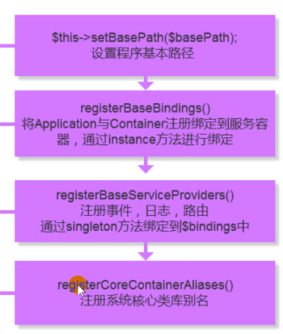
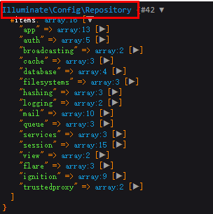
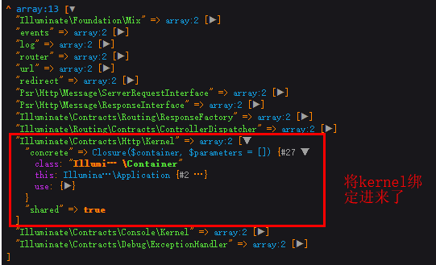
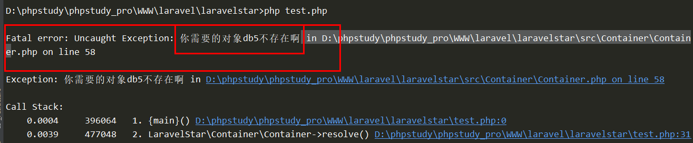

# 手写laravel之探究生命周期
## 1.生命周期
所有的生命周期都要从入口文件开始(public/index.php)
````
<?php
define('LARAVEL_START', microtime(true));
//加载命令规范
    require __DIR__.'/../vendor/autoload.php';
//加载应用程序,初始化
    $app = require_once __DIR__.'/../bootstrap/app.php';
//进行解析
//Illuminate\Contracts\Http\Kernel::class 这里是可以通过这种写法直接获取对象的地址
    $kernel = $app->make(Illuminate\Contracts\Http\Kernel::class);
//获取响应结果
    $response = $kernel->handle(
        $request = Illuminate\Http\Request::capture()
    );
//响应输出
    $response->send();

    $kernel->terminate($request, $response);
````
## 2.理解初始化
这里我们开始分析(应用程序是怎么加载的?)
````
app.php->Illuminate\Foundation\Application 也就是laravel和核心运行程序,也就代表当前的整个框架
````
那我们要先通过``bootstrap/app.php``了解加载应用程序的过程
````
<?php
$app = new Illuminate\Foundation\Application(
    $_ENV['APP_BASE_PATH'] ?? dirname(__DIR__)
);


$app->singleton(
    Illuminate\Contracts\Http\Kernel::class,
    App\Http\Kernel::class
);

$app->singleton(
    Illuminate\Contracts\Console\Kernel::class,
    App\Console\Kernel::class
);

$app->singleton(
    Illuminate\Contracts\Debug\ExceptionHandler::class,
    App\Exceptions\Handler::class
);


return $app;
````
先了解下(Application),根据composer的``autoload_psr4.php``查看根目录位置
````
$app = new Illuminate\Foundation\Application(
    $_ENV['APP_BASE_PATH'] ?? dirname(__DIR__)
);
````
对于对象一定要查看构造函数执行的内容
````
public function __construct($basePath = null)
    {
        if ($basePath) {
            $this->setBasePath($basePath);
        }
        //注册核心服务到服务提供者
        $this->registerBaseBindings();
        //注册应用服务提供者
        $this->registerBaseServiceProviders();
        //注册核心应用程序的别名
        $this->registerCoreContainerAliases();
    }

     
     protected function registerBaseServiceProviders()
        {    //注册事件,日志,路由的服务提供者
            $this->register(new EventServiceProvider($this));
            $this->register(new LogServiceProvider($this));
            $this->register(new RoutingServiceProvider($this));
        }
    //注册别名
    public function registerCoreContainerAliases()
        {
            foreach ([
                'app'                  => [self::class, \Illuminate\Contracts\Container\Container::class, \Illuminate\Contracts\Foundation\Application::class, \Psr\Container\ContainerInterface::class],
                'config'               => [\Illuminate\Config\Repository::class, \Illuminate\Contracts\Config\Repository::class],
    //....
            ] as $key => $aliases) {
                foreach ($aliases as $alias) {
                    $this->alias($key, $alias);
                }
            }
        }
````


关于注册别名,我们以``config``为例
````
这里的注册实则和我们在服务提供者中 boot 方法 注册的方式类似,不过过程复杂一些

通过路由打印以下
    Route::get('test', function () {
        dd(app()->make('config'));
    });
````

## 3.基础分析kernel
在``public/index.php``中通过``$app = require_once __DIR__.'/../bootstrap/app.php';``初始化后,开始解析,也就是``$kernel = $app->make(Illuminate\Contracts\Http\Kernel::class);``

那是怎么解析的呢?我们又来到了``bootstrap\app.php``中
````
$app->singleton(
    Illuminate\Contracts\Http\Kernel::class,
    App\Http\Kernel::class
);

$app->singleton(
    Illuminate\Contracts\Console\Kernel::class,
    App\Console\Kernel::class
);

$app->singleton(
    Illuminate\Contracts\Debug\ExceptionHandler::class,
    App\Exceptions\Handler::class
);

dd($app->getBind);
````
为了方便理解,我们可以在这里``dd``以下



发向它将``Illuminate\Contracts\Http\Kernel::class``作为标识绑定进了容器,而真正的实例是``App\Http\Kernel.php``,那么在生命中期(public/index.php)中的以下操作,也就与``App\Http\Kernel.php``有关
````
$response = $kernel->handle(
    $request = Illuminate\Http\Request::capture()
);
````
而``App\Http\Kernel.php``继承于``Illuminate\Foundation\Http\Kernel``那我们关注它就好了
## 4.实现容器
### 4.1 补充
````
<?php
class Index{
    public function __construct($a = 1,$b=2)
    {
          echo $a;
          echo $b;
     }
}
$arr[]=33;
$arr[]=44;
new  Index(... $arr);

结果:
3344

------------------------------------------------------------------
判断传入的参数是否为闭包

public function resolve($abstract, $parameters = [])
{
    $obj = $this->bindings[$abstract];

    //进行容器类型的判断
    if ($obj instanceof \Closure){
        //如果是闭包就执行闭包
        return $obj();
    }
    //判断是否未object
    if(is_object($obj)){
        return $obj;
    } else{
        //不是对象就要创建并返回
        return new $obj(... $parameters);
    }
 }
````
### 4.2 初步完成
````
<?php
/**
 * Create By: Will Yin
 * Date: 2020/7/29
 * Time: 10:31
 **/
namespace LaravelStar\Container;

class Container
{
    //绑定的容器
    protected $bindings = [];
    /**
     进行绑定的方法
     * @param  $abstract string  容器的标识
     * @param  $concrete object  容器实例/对象地址/闭包
     */
    public function bind($abstract, $concrete)
    {
        $this->bindings[$abstract] = $concrete;
     }

    /**
     进行解析的方法
     * @param  $concrete object  容器实例/对象地址/闭包
     */
    public function make($abstract)
    {
        return $this->resolve($abstract);
      }

    /**
     执行解析操作的方法
     */
    public function resolve($abstract, $parameters = [])
    {
        $obj = $this->bindings[$abstract];

        //进行容器类型的判断
        if ($obj instanceof \Closure){
            //如果是闭包就执行闭包
            return $obj();
        }
        //判断是否未object
        if(is_object($obj)){
            return $obj;
        } else{
            //不是对象就要创建并返回
            return new $obj(... $parameters);
        }
     }
    
   //获取所有绑定的对象
    public function getBindings()
    {
        return $this->bindings;
    }
}
````
进行测试
````
<?php
/**
 * Create By: Will Yin
 * Date: 2020/7/29
 * Time: 11:01
 **/
require __DIR__.'/vendor/autoload.php';

use LaravelStar\Container\Container;

$ioc = new Container();

//这里可以不实现,因为这里的 db类 在绑定的时候仅仅就是一个标识
class mysql implements db{
  public function index(){
    echo "this is db";
   }
}

interface db{

}

//(框架)进行注册绑定的方式(四种类型)
$ioc->bind('db1',mysql::class);
$ioc->bind('db2',new mysql());
$ioc->bind('db3',function (){
    return new mysql();
});
$ioc->bind(db::class,new mysql());

var_dump($ioc->getBindings());\
---------------------------------------------------------------------------------------------------
D:\phpstudy\phpstudy_pro\WWW\laravel\laravelstar>php test.php

array(4) {
  'db1' =>
  string(5) "mysql"
  'db2' =>
  class mysql#2 (0) {
  }
  'db3' =>
  class Closure#4 (0) {
  }
  'db' =>
  class mysql#5 (0) {
  }
}

````
### 4.3 进行容器的完善
创建单例,完全仿照了laravel的写法
````
 public static function setInstance(ContainerContract $container = null)
    {
        return static::$instance = $container;
    }

    public static function getInstance()
    {
        if (is_null(static::$instance)) {
            static::$instance = new static;
        }

        return static::$instance;
    }
````
那么为什么单例不在构造函数中进行
````
<?php

namespace Illuminate\Foundation;
//..
use Illuminate\Container\Container;
//..
class Application extends Container implements ApplicationContract, HttpKernelInterface
{
    public function __construct($basePath = null)
        {
            if ($basePath) {
                $this->setBasePath($basePath);
            }
    
            $this->registerBaseBindings();
            //..
        }
     protected function registerBaseBindings()
        {
            static::setInstance($this);
            //...
        }
}
````
它是在``Illuminate\Foundation\Application``中的``__construct``进行单例模式的构建,原因是在``bootstrap\app.php``中
````
$app = new Illuminate\Foundation\Application(
    $_ENV['APP_BASE_PATH'] ?? dirname(__DIR__)
);
````
Application只被new一次,而且考略到代码的分离(可以看到Application的构造函数中做了很多事情),单独抽离出来
### 4.4 完成的容器类
````
<?php
/**
 * Create By: Will Yin
 * Date: 2020/7/29
 * Time: 10:31
 **/
namespace LaravelStar\Container;

use LaravelStar\Contracts\Container as ContainerContract;

class Container
{
    // 单例
    protected static $instance;

    /**
     * 共享实例 => 对容器进行单例创建和运用
     */
    protected $instances = [];

    //绑定的容器
    protected $bindings = [];

    /**
     进行绑定的方法,非单例绑定
     * @param  $abstract string  容器的标识
     * @param  $concrete object  容器实例/对象地址/闭包
     * @param  $shared   bool  判断是否为单例 false为不单例
     */
    public function bind($abstract, $concrete,$shared = false)
    {
        $this->bindings[$abstract]['shared'] = $shared;
        $this->bindings[$abstract]['$concrete'] = $concrete;
     }

    /**
     * 进行绑定的方法,单例绑定
     * @param  $abstract string  容器的标识
     * @param  $concrete object  容器实例/对象地址/闭包
     * @param  $shared   bool  判断是否为单例 true为单例
     */
    public function singleton($abstract, $concrete = null,$shared = true)
    {
        $this->bind($abstract, $concrete,$shared);
     }
    /**
     进行解析的方法
     * @param  $concrete object  容器实例/对象地址/闭包
     */
    public function make($abstract)
    {
        return $this->resolve($abstract);
      }

    /**
     执行解析操作的方法
     */
    public function resolve($abstract, $parameters = [])
    {
        if(!$this->has($abstract)){
           throw new \Exception('你需要的对象'.$abstract.'不存在啊');
        }
        //判断对象是否之前创建过,创建过直接返回
        if(isset( $this->instances[$abstract] )){
         return  $this->instances[$abstract];
        }
        $obj = $this->bindings[$abstract]['$concrete'];

        //进行容器类型的判断
        if ($obj instanceof \Closure){
            //如果是闭包就执行闭包
            return $obj();
        }
        //判断是否未object
        if(!is_object($obj)){
            //这里不是对象我们就新型创建
             $object = new $obj(... $parameters);
        }
        //对创建的对象放置到 共享实例 $instances 中,并判断是否使用单例
        if($this->bindings[$abstract]['shared']){
            return $this->instances[$abstract]=$object;
        }

        return $object;
     }

    /**
     * 校验调用的对象是否存在
     * @param $abstract string  容器的标识
     */
    public function has($abstract)
    {
        return isset($this->bindings[$abstract]['$concrete']) || isset($this->instances[$abstract]);
    }
    public function getBindings()
    {
        return $this->bindings;
    }

    /*
     * 设置单例模式
     * */
    public static function setInstance(ContainerContract $container = null)
    {
        return static::$instance = $container;
    }

    public static function getInstance()
    {
        if (is_null(static::$instance)) {
            static::$instance = new static;
        }
        return static::$instance;
    }
}
````
测试:
````
<?php
/**
 * Create By: Will Yin
 * Date: 2020/7/29
 * Time: 11:01
 **/
require __DIR__.'/vendor/autoload.php';

use LaravelStar\Container\Container;

$ioc = new Container();

class mysql implements db{
  public function index(){
    echo "this is db";
   }
}

interface db{

}

//(框架)进行注册绑定的方式(四种类型)
$ioc->bind('db1',mysql::class);
$ioc->bind('db2',new mysql());
$ioc->bind('db3',function (){
    return new mysql();
});
$ioc->bind(db::class,new mysql());

$ioc->resolve('db5');
````

## 5.关于契约
什么是契约?
>是一种约束(实质就是接口),那么为什么要约束?约束那些内容?
````
abstract 是 抽象类 ,只能单继承,并且要事项内部的所有方法
interface 是 接口 ,可以多继承
````


