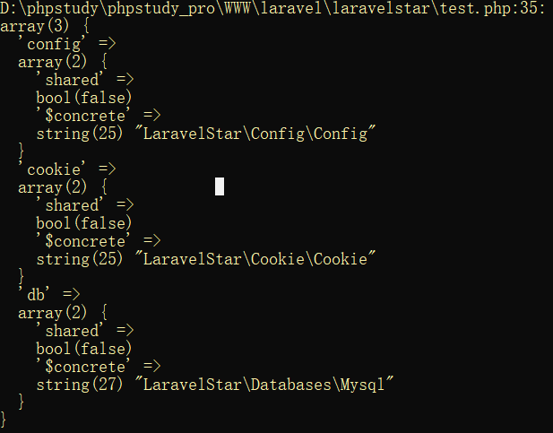

# Application构建与门面实现
## 1. Application初步构架 
设置共享容器(``LaravelStar\Container\Containe instance()``)
````
<?php
/**
 * Create By: Will Yin
 * Date: 2020/7/29
 * Time: 10:31
 **/
namespace LaravelStar\Container;

use LaravelStar\Contracts\Container as ContainerContract;

class Container
{
    // 单例
    protected static $instance;


    /**
     * 共享实例 => 对容器进行单例创建和运用
     */
    protected $instances = [];

    //绑定的容器
    protected $bindings = [];

    //容器,注册的类型别名
    protected $aliases = [];

    //容器,由抽象名称键入的已注册别名。
    protected $abstractAliases = [];
    /**
     进行绑定的方法,非单例绑定
     * @param  $abstract string  容器的标识
     * @param  $concrete object  容器实例/对象地址/闭包
     * @param  $shared   bool  判断是否为单例 false为不单例
     */
    public function bind($abstract, $concrete,$shared = false)
    {
        $this->bindings[$abstract]['shared'] = $shared;
        $this->bindings[$abstract]['$concrete'] = $concrete;
     }

    /**
     * 进行绑定的方法,单例绑定
     * @param  $abstract string  容器的标识
     * @param  $concrete object  容器实例/对象地址/闭包
     * @param  $shared   bool  判断是否为单例 true为单例
     */
    public function singleton($abstract, $concrete = null,$shared = true)
    {
        $this->bind($abstract, $concrete,$shared);
     }
    /**
     进行解析的方法
     * @param  $concrete object  容器实例/对象地址/闭包
     */
    public function make($abstract)
    {
        return $this->resolve($abstract);
      }

    /**
     执行解析操作的方法
     */
    public function resolve($abstract, $parameters = [])
    {
        if(!$this->has($abstract)){
           throw new \Exception('你需要的对象'.$abstract.'不存在啊');
        }
        //判断对象是否之前创建过,创建过直接返回
        if(isset( $this->instances[$abstract] )){
         return  $this->instances[$abstract];
        }
        $obj = $this->bindings[$abstract]['$concrete'];

        //进行容器类型的判断
        if ($obj instanceof \Closure){
            //如果是闭包就执行闭包
            return $obj();
        }
        //判断是否未object
        if(!is_object($obj)){
            //这里不是对象我们就新型创建
             $object = new $obj(... $parameters);
        }
        //对创建的对象放置到 共享实例 $instances 中,并判断是否使用单例
        if($this->bindings[$abstract]['shared']){
            return $this->instances[$abstract]=$object;
        }

        return $object;
     }

    /**
     * 校验调用的对象是否存在
     * @param $abstract string  容器的标识
     */
    public function has($abstract)
    {
        return isset($this->bindings[$abstract]['$concrete']) || isset($this->instances[$abstract]);
    }
    public function getBindings()
    {
        return $this->bindings;
    }
    //-------------------------------------------------------------------------
    /*
     * 设置单例模式
     * */
    public static function setInstance( $container = null)
    {
        return static::$instance = $container;
    }

    public static function getInstance()
    {
        if (is_null(static::$instance)) {
            static::$instance = new static;
        }

        return static::$instance;
    }

    //-------------------------------------------------------------------------
    /**
     * 设置共享实例(这个实例可能并没有绑定在容器中,因此要额外的设置)
     * @param $abstract string 标识
     * @param $instance object 共享实例对象
     * 从 $bindings 属性中 移动至 $instance属性中,laravel实现过程更为复杂一些
     */
    //laravel中Application中通过 $this->instance('app', $this); 这种方式将自身绑定进入容器
    public function instance($abstract, $instance)
    {
         $this->removeBindinds($abstract);
         $this->instances[$abstract] = $instance;
     }

     //进行对象的转移(源码中的移除/添加)
    public function removeBindinds($abstract)
    {
        if(isset($this->bindings[$abstract])){
            unset($this->bindings[$abstract]);
        }
        return;
     }
}
````
初始化``Application``并指定自生的绑定方法
````
<?php
/**
 * Create By: Will Yin
 * Date: 2020/7/30
 * Time: 20:27
 **/
namespace LaravelStar\Foundation;
use LaravelStar\Container\Container;

//它就是laravel的一个心脏
class  Application extends Container{

    //设置路径
    protected $basePath;

    public function __construct($basePath = null)
    {
        if ($basePath) {
            $this->setBasePath($basePath);
        }

        //注册核心应用到容器中
        $this->registerBaseBindings();
        //注册核心容器到服务提供者(事件/日志/路由)
        //$this->registerBaseServiceProviders();

        //注册应用容器的别名
        $this->registerCoreContainerAliases();
    }

    public function setBasePath($basePath)
    {
        //记录项目根目录的地址,方便后期应用
        $this->basePath = rtrim($basePath, '\/');

        return $this;
    }

    /**
     * 注册核心应用到容器中
     */
    public function registerBaseBindings()
    {
        //设置单例模式
        static::setInstance($this);
        //将自身(Application)绑定到容器中
        $this->instance('app',$this);
     }

    /**
     * 自身的注册方法,注册如 config/cookie .. (在容器中注册核心类别名)
     * 源码中实现的较为复杂一些
     */
    public function registerCoreContainerAliases()
    {
        $bind = [
            'config' => \LaravelStar\Config\Config::class,
            'cookie' => \LaravelStar\Cookie\Cookie::class,
            'db' => \LaravelStar\Databases\Mysql::class,
        ];
          foreach ( $bind as $key => $val){
            $this->bind($key,$val);
          }
      }
}
````
测试
````
<?php
require __DIR__.'/vendor/autoload.php';
use LaravelStar\Foundation\Application;

var_dump((new Application())->getBindings());
````

````
<?php
require __DIR__.'/vendor/autoload.php';
use LaravelStar\Foundation\Application;

var_dump((new Application())->getBindings());
````

## 2. 助手函数的引用
在Laravel中``src/Illuminate/Support``目录下存在许多的工具类,而``src/Illuminate/Support/helpers.php``我们称之为助手函数

那它是怎么引入的呢?在``src/Illuminate/Support/composer.json``中
````
"autoload": {
        "psr-4": {
            "Illuminate\\Support\\": ""
        },
        "files": [
            "helpers.php"
        ]
    },
````
我们的写法
````
{
    "name": "willyin/laravelstar",
    "description": "this is branch for laravel",
    "type": "library",
    "license": "MIT",
    "authors": [
        {
            "name": "will",
            "email": "826895143@qq.com"
        }
    ],
    "require": {},
    "autoload": {
        "psr-4": {
            "LaravelStar\\": "src/"
        },
        "files": [
            "src\\Support\\helpers.php"
        ]
    }
}

````
laravel中是怎么样通过helper.php引入``app``对象的呢?查看``src/Illuminate/Foundation/helpers.php``
````
if (! function_exists('app')) {
    function app($abstract = null, array $parameters = [])
    {
        if (is_null($abstract)) {
            return Container::getInstance();
        }
        return Container::getInstance()->make($abstract, $parameters);
    }
}
````
下面我们就进行定义我们自己的助手函数,引入app对象
````
<?php
/**
 * Create By: Will Yin
 * Date: 2020/7/30
 * Time: 21:48
 **/
use LaravelStar\Container\Container;
use LaravelStar\Foundation\Application;
/*
 * 助手函数
 * 可以快速的解析容器的实例方法
 * */
if (! function_exists('app')) {
    function app($abstract = null, array $parameters = [])
    {
        if (is_null($abstract)) {
            return Application::getInstance();
        }
        return Application::getInstance()->make($abstract, $parameters);
    }
}
````
测试(先执行composer dump-autoload):
````
<?php
/**
 * Create By: Will Yin
 * Date: 2020/7/29
 * Time: 11:01
 **/
require __DIR__.'/vendor/autoload.php';

echo app()->make('db')->select();
````

## 3. 引入框架结构
创建框架结构


修改``composer.json文件``
````
{
    "name": "willyin/laravel_frame",
    "description": "this is the main frame for laravel",
    "type": "project",
    "authors": [
        {
            "name": "will",
            "email": "826895143@qq.com"
        }
    ],
    "repositories": {
        "willyin": {
            "type" : "path",
            "url" : "../laravelstar"
        }
    },
    "require": {
        "willyin/laravelstar" : "master-dev"
    },
    "autoload": {
        "psr-4": {
            "App\\": "app"
        }
    }
}
````


测试
````
<?php
require_once __DIR__.'/vendor/autoload.php';

echo app()->make('db')->select();
````

## 4. 契约实现
我们这里还存在问题
````
 public function registerCoreContainerAliases()
    {
        $bind = [
            'config' => \LaravelStar\Config\Config::class,
            'cookie' => \LaravelStar\Cookie\Cookie::class,
            //'db' => \LaravelStar\Databases\Mysql::class,
            'db' => \LaravelStar\Databases\oracle::class,
        ];
          foreach ( $bind as $key => $val){
            $this->bind($key,$val);
          }
      }
````
>将mysql替换成oracle就会出翔问题


这里就体现出了契约的作用,我们来实现契约
````
<?php
/**
 * Create By: Will Yin
 * Date: 2020/7/30
 * Time: 22:43
 **/
namespace LaravelStar\Contracts\Database;

interface DB{
  //用于查询的方法
  public function select();

}
------------------------------------Mysql-------------------------------------
<?php
/**
 * Create By: Will Yin
 * Date: 2020/7/30
 * Time: 20:35
 **/
namespace LaravelStar\Databases;
use LaravelStar\Contracts\Database\DB;

class mysql implements DB{

  public function select(){
     return "this is mysql class";
   }

}
------------------------------------Oracle-------------------------------------
<?php
/**
 * Create By: Will Yin
 * Date: 2020/7/30
 * Time: 20:35
 **/
namespace LaravelStar\Databases;
use LaravelStar\Contracts\Database\DB;

class oracle implements DB{

    public function select(){
        return "this is oracel class";
    }

}
------------------------------------Application-------------------------------------
public function registerCoreContainerAliases()
    {
        $bind = [
            'config' => \LaravelStar\Config\Config::class,
            'cookie' => \LaravelStar\Cookie\Cookie::class,
            'db' => \LaravelStar\Databases\Mysql::class,
            'or' => \LaravelStar\Databases\Oracle::class,
        ];
          foreach ( $bind as $key => $val){
            $this->bind($key,$val);
          }
      }
````
测试
````
<?php
require_once __DIR__.'/vendor/autoload.php';

echo app()->make('db')->select().PHP_EOL;

echo app()->make('or')->select();
````

## 5. facede引入与实现
所有的``facades(src/Illuminate/Support/Facades)``都继承了了父类``Illuminate\Support\Facades\Facade``并且重写了里面的``getFacadeAccessor()``方法
````
 protected static function getFacadeAccessor()
    {
        throw new RuntimeException('Facade does not implement getFacadeAccessor method.');
    }
````
通过``getFacadeRoot()``方法进行解析
````
    public static function getFacadeRoot()
    {
        return static::resolveFacadeInstance(static::getFacadeAccessor());
    }
   
    //具体通过该方法实现解析过程
    protected static function resolveFacadeInstance($name)
     {
        //判断是否是一个对象
         if (is_object($name)) {
             return $name;
         }
        //判断是否解析过了
         if (isset(static::$resolvedInstance[$name])) {
             return static::$resolvedInstance[$name];
         }

         //通过dd(static::$app)发现它就是Application对象

         if (static::$app) {
             return static::$resolvedInstance[$name] = static::$app[$name];
         }
     }
````
那么``return static::$resolvedInstance[$name] = static::$app``作用是什么呢?我们来看下``setFacadeApplication()``方法
````
public static function setFacadeApplication($app)
    {
        static::$app = $app;
    }
````
那它是在哪里调用的呢?在``Illuminate\Foundation\Bootstrap\RegisterFacades.php``
````
    public function bootstrap(Application $app)
    {
        Facade::clearResolvedInstances();
    
        //这里就调用了setFacadeApplication()方法
        Facade::setFacadeApplication($app);
    
        AliasLoader::getInstance(array_merge(
            $app->make('config')->get('app.aliases', []),
            $app->make(PackageManifest::class)->aliases()
        ))->register();
    }
````
因此``static::$app``就是``Application``这个对象,那么为什么要以``static::$app``这种方式调用``Application``这个对象?我们接下来再说明
````
    if (static::$app) {
        return static::$resolvedInstance[$name] = static::$app[$name];
    }
````
### 5.1 手动实现facede
````
<?php
/**
 * Create By: Will Yin
 * Date: 2020/7/31
 * Time: 9:56
 **/
namespace LaravelStar\Support\Facades;

abstract class Facade{

    protected static $app;

    //存储已经解析的门面对象的具体实例对象
    protected static $resolvedInstance;

    //获取门面类的根目录
    public static function getFacadeRoot()
    {
        return static::resolveFacadeInstance(static::getFacadeAccessor());
    }

    /**
     * __callStatic 调用不存在的静态方法自动调用
     * @param $method string 方法名
     * @param $args   array 参数
     */
    public static function __callStatic($method, $args = [])
    {
        $instance = static::getFacadeRoot();

        if (! $instance) {
            throw new \Exception('对不起找不到可解析的实例对象,请检查 getFacadeAccessor ',500);
        }

        return $instance->$method(...$args);
    }

    //进行门面解析的方法
    protected static function getFacadeAccessor(){}
//    {
//        throw new \Exception('没有对应的 facade 对象',500);
//    }
    //执行门面解析的具体方法
    protected static function resolveFacadeInstance($name)
    {
        //判断是否为对象
        if (is_object($name)) {
            return $name;
        }
        //判断是否创建过(解析过)
        if (isset(static::$resolvedInstance[$name])) {
            return static::$resolvedInstance[$name];
        }
        //解析实例对象
        //if (static::$app) {
        //    return static::$resolvedInstance[$name] = static::$app[$name];
        //}
        //这里我们不采用上方的写法(Laravel写法),我们直接通过app()调用;
        return static::$resolvedInstance[$name] = app($name);
    }

    /**
     * 获取应用程序(Application)实例。
     * @param  \Laravel\Foundation\Application  $app
     */
    public static function getFacadeApplication()
    {
        return static::$app;
    }

    /**
     * 设置应用程序(Application)实例。
     * @param  \Laravel\Foundation\Application  $app
     */
    public static function setFacadeApplication($app)
    {
        static::$app = $app;
    }
}
````
我们注册一个mysql的门面方法
````
<?php
/**
 * Create By: Will Yin
 * Date: 2020/7/31
 * Time: 10:22
 **/
namespace LaravelStar\Support\Facades;

class DB extends Facade{

    protected static function getFacadeAccessor()
    {
       return "db";
    }
}
````
测试
````
<?php
require_once __DIR__.'/vendor/autoload.php';

echo LaravelStar\Support\Facades\DB::select();
````

### 5.2 引入arrayAccess接口
我们再``Facade``类中实现调用app的方式与laravel源码中又区别,区别就是我们上面所抛出的问题,怎样``将对象转行成数组进行调用``,laravel中使用了``arrayAccess``这个接口进行调用(这个接口是php内核为我们提供的)
````
interface ArrayAccess {

    public function offsetExists($offset);

    public function offsetGet($offset);

    public function offsetSet($offset, $value);

    public function offsetUnset($offset);
}
````
当对象以``implements``方式实现接口时,调用内部的方法(如 : offsetGet)就会自动触发

那么我们修改``Facade``类以``static::$app[$name]``方式调用app对象
````
 protected static function resolveFacadeInstance($name)
    {
        //判断是否为对象
        if (is_object($name)) {
            return $name;
        }
        //判断是否创建过(解析过)
        if (isset(static::$resolvedInstance[$name])) {
            return static::$resolvedInstance[$name];
        }
        //解析实例对象
        //if (static::$app) {
        //    return static::$resolvedInstance[$name] = static::$app[$name];
        //}
        //这里我们不采用上方的写法(Laravel写法),我们直接通过app()调用;
       // return static::$resolvedInstance[$name] = app($name);
        return static::$resolvedInstance[$name] = static::$app[$name];
    }
````
再容器类中实现接口``ArrayAccess``
````
use ArrayAccess;
class Container implements ArrayAccess
{
  //-----------------------------------------实现接口ArrayAccess中方法
      public function offsetExists($key)
      {
          var_dump("offsetExists");
      }
  
      public function offsetGet($key)
      {
          return $this->make($key);
      }
      public function offsetSet($key, $value)
      {
          var_dump("offsetSet");
      }
      public function offsetUnset($key)
      {
          var_dump("offsetUnset");
      }  
}
````
在Application中绑定自身到门面对象中
````
class  Application extends Container{

    public function __construct($basePath = null)
    {
        //将自生设置再facade中
        \LaravelStar\Support\Facades\Facade::setFacadeApplication($this);
    }
}
````
测试
````
<?php
require_once __DIR__.'/vendor/autoload.php';

//初试化Application
$app = new \LaravelStar\Foundation\Application($_ENV['APP_BASE_PATH'] ?? dirname(__DIR__));

echo LaravelStar\Support\Facades\DB::select();
````


