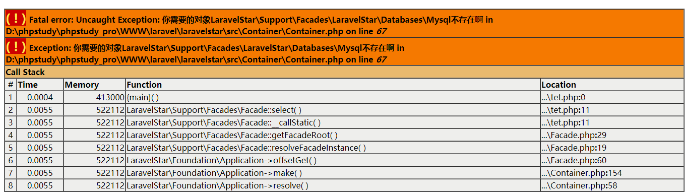
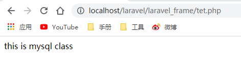
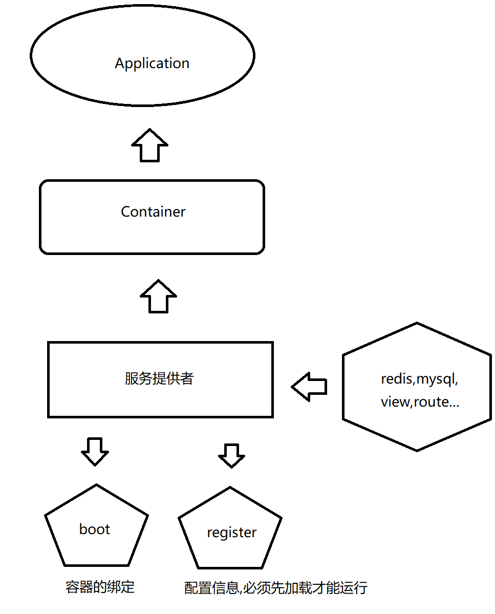
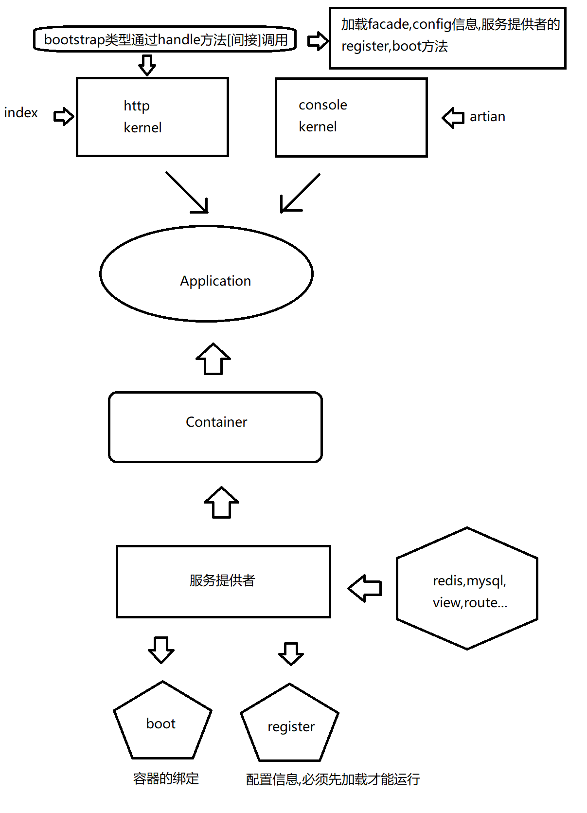
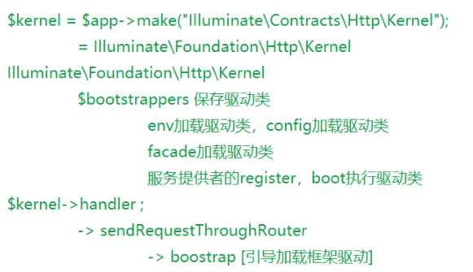
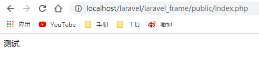
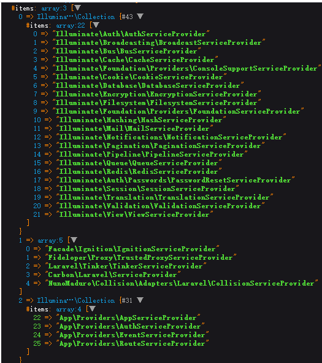
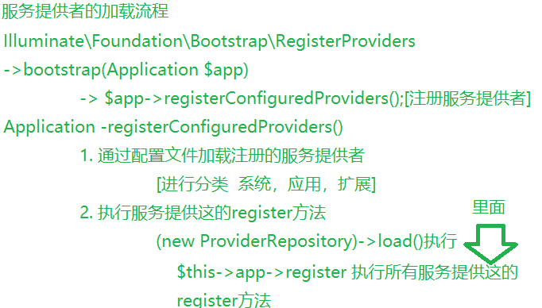
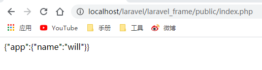

# 理解理解laravel驱动及服务提供者
## 0. 使用make方法解析时存在的问题
修改以下门面方法
````
<?php
namespace LaravelStar\Support\Facades;

class DB extends Facade{

    protected static function getFacadeAccessor()
    {
       //return "db";

       //返回一个实例对象的时候,就会抛出错误
       return LaravelStar\Databases\Mysql::class;
    }
}
````


模仿laravel写法构建一个方法进行解析
````
 protected function getClosure($abstract, $concrete)
    {
        return function ($container, $parameters = []) use ($abstract, $concrete) {
            if ($abstract == $concrete) {
                return $container->build($concrete);
            }

            return $container->resolve(
                $concrete, $parameters, $raiseEvents = false
            );
        };
    }
````
解决方式:
````
<?php
namespace LaravelStar\Container;
use ArrayAccess;
use LaravelStar\Contracts\Container as ContainerContract;

class Container implements ArrayAccess
{
   //....     

    public function make($abstract)
    {
        return $this->resolve($abstract);
      }

    /**
     执行解析操作的方法
     */
    public function resolve($abstract, $parameters = [])
    {
        //if(!$this->has($abstract)){
        //   throw new \Exception('你需要的对象'.$abstract.'不存在啊');
        //}

        //判断对象是否之前创建过,创建过直接返回
        if(isset( $this->instances[$abstract] )){
         return  $this->instances[$abstract];
        }

        //解决门面直接传入对象问题
        $obj = $this->getClosure($abstract);

        //进行容器类型的判断
        if ($obj instanceof \Closure){
            //如果是闭包就执行闭包
            return $obj();
        }
        //判断是否未object
        if(!is_object($obj)){
            //这里不是对象我们就新型创建
             $object = new $obj(... $parameters);
        }
        //对创建的对象放置到 共享实例 $instances 中,并判断是否使用单例
        if($this->has($abstract) && $this->bindings[$abstract]['shared']){
            return $this->instances[$abstract]=$object;
        }

        return $object;
     }

    /**
     * getClosure,解决门面直接传入对象问题
     * @param $abstract string 标识
     */
    public function getClosure($abstract)
    {
        if($this->has($abstract)){
            $abstract =  $this->bindings[$abstract]['$concrete'];
        }
        return $abstract;

    }
    /**
     * 校验调用的对象是否存在
     * @param $abstract string  容器的标识
     */
    public function has($abstract)
    {
        return isset($this->bindings[$abstract]['$concrete']) || isset($this->instances[$abstract]);
    }
 
   //...
}
````
测试:
````
<?php
namespace LaravelStar\Support\Facades;

class DB extends Facade{

    protected static function getFacadeAccessor()
    {
       //return "db";
       return \LaravelStar\Databases\Mysql::class;
    }
}
````

## 1. 理解laravel的服务提供者加载


Laravel中时一次性加载(执行)完成所有服务提供者``register``方法后,再执行所有的boot方法


### 1.1 代码理解驱动类的加载执行
在``bootstrap/app.php``中进行注册绑定
````
$app->singleton(
    Illuminate\Contracts\Http\Kernel::class,
    App\Http\Kernel::class
);
````
在``public/index.php``进行解析
````
$kernel = $app->make(Illuminate\Contracts\Http\Kernel::class);

$response = $kernel->handle(
    $request = Illuminate\Http\Request::capture()
);
````
因为``app/Http/Kernel.php``继承的类就是``Illuminate\Foundation\Http\Kernel as HttpKernel``所有我们看一下
````
 /**
     * 创建一个新的HTTP内核实例.
     */
    public function __construct(Application $app, Router $router)
    {
        $this->app = $app;
        $this->router = $router;

        $this->syncMiddlewareToRouter();
    }

    /**
     * 处理传入的HTTP请求。
     */
    public function handle($request)
    {
        try {
            $request->enableHttpMethodParameterOverride();
            
            //分发请求到指定的路由
            $response = $this->sendRequestThroughRouter($request);

        } catch (Exception $e) {
            $this->reportException($e);

            $response = $this->renderException($request, $e);
        } catch (Throwable $e) {
            $this->reportException($e = new FatalThrowableError($e));

            $response = $this->renderException($request, $e);
        }

        $this->app['events']->dispatch(
            new RequestHandled($request, $response)
        );

        return $response;
    }

     /**
         * 通过中间件/路由器发送给定的请求。
         */
    protected function sendRequestThroughRouter($request)
    {
        $this->app->instance('request', $request);
    
        Facade::clearResolvedInstance('request');
    
        //关注下这个方法
        $this->bootstrap();
    
        return (new Pipeline($this->app))
                    ->send($request)
                    ->through($this->app->shouldSkipMiddleware() ? [] : $this->middleware)
                    ->then($this->dispatchToRouter());
    }

    /**
         * 为HTTP请求引导应用程序。
         */
        public function bootstrap()
        {
            if (! $this->app->hasBeenBootstrapped()) {
                                          //这里就是 return 了  bootstrappers 属性
                $this->app->bootstrapWith($this->bootstrappers());
            }
        }

     /**
         * 获取应用程序的引导类
         */
        protected function bootstrappers()
        {
                          //返回了一个数据 即 bootstrappers属性
            return $this->bootstrappers;
        }
        protected $bootstrappers = [
                \Illuminate\Foundation\Bootstrap\LoadEnvironmentVariables::class,
                \Illuminate\Foundation\Bootstrap\LoadConfiguration::class,
                \Illuminate\Foundation\Bootstrap\HandleExceptions::class,
                \Illuminate\Foundation\Bootstrap\RegisterFacades::class,
                \Illuminate\Foundation\Bootstrap\RegisterProviders::class,
                \Illuminate\Foundation\Bootstrap\BootProviders::class,
            ];
````


那么怎么执行呢?实际就是调用了Application中的``bootstrapWith()``方法
````
public function bootstrapWith(array $bootstrappers)
    {
        //$this->hasBeenBootstrapped = true;

        foreach ($bootstrappers as $bootstrapper) {
            //$this['events']->dispatch('bootstrapping: '.$bootstrapper, [$this]);

            $this->make($bootstrapper)->bootstrap($this);

            //$this['events']->dispatch('bootstrapped: '.$bootstrapper, [$this]);
        }
    }
````
给一些注释,实则就是一个循环解析的过程,这里必须要存在``bootstrap``这个驱动类
### 1.2 驱动类的加载
模范者Laravel的写法,先完成``public/index.php``的编写
````
<?php
require __DIR__ . '/../vendor/autoload.php';

use LaravelStar\Foundation\Application;
$app = new Application($_ENV['APP_BASE_PATH'] ?? dirname(__DIR__));


// 处理http请求的
$app->singleton(
    //契约,一个接口规范
    \LaravelStar\Contracts\Http\Kernel::class,
    //我们的 Kernel 类
    \App\Http\Kernel::class
);
$kernel = $app->make(\LaravelStar\Contracts\Http\Kernel::class, [$app]);
$response = $kernel->handle();
````
这里进行一个单例的绑定
````
<?php
namespace App\Http;
use LaravelStar\Foundation\Http\Kernel as HttpKernel;

class Kernel extends HttpKernel
{

}
````
``App\Http\Kernel.php``的父类为``LaravelStar\Foundation\Http\Kernel``这里我们模仿laravel只完成核心的方法
````
<?php
/**
 * Create By: Will Yin
 * Date: 2020/7/31
 * Time: 21:15
 **/
namespace LaravelStar\Foundation\Http;

use LaravelStar\Contracts\Http\Kernel as Contracts;
use LaravelStar\Foundation\Application;

// 处理http请求的核心对象
class Kernel implements Contracts
{
    /**
     * [protected description]
     * @var \LaravelStar\Foundation\Application
     */
    protected $app;
    /**
     * 保存驱动类
     */
    protected $bootstrappers = [
        \LaravelStar\Foundation\Bootstrap\RegisterFacades::class,
        \LaravelStar\Foundation\Bootstrap\LoadConfiguration::class,
    ];

    public function __construct(Application $app = null)
    {
        $this->app = $app;
    }

    public function handle($request = null)
    {
        $this->sendRequestThroughRouter($request);
    }
    public function sendRequestThroughRouter($request = null)
    {
        $this->bootstrap();
    }
    /**
     * 加载框架的驱动方法
     */
    public function bootstrap()
    {
        foreach ($this->bootstrappers as $bootstrapper) {
            $this->app->make($bootstrapper)->bootstrap($this->app);
        }
    }
}
````
那么在``public\index.php``中的``handle``方法也就时我们的核心,追溯到``LaravelStar\Foundation\Http\Kernel.php``中,实则核心方法就是``bootstrap()``,源码中
````
public function bootstrapWith(array $bootstrappers)
    {
        //$this->hasBeenBootstrapped = true;

        foreach ($bootstrappers as $bootstrapper) {
            //$this['events']->dispatch('bootstrapping: '.$bootstrapper, [$this]);

            $this->make($bootstrapper)->bootstrap($this);

            //$this['events']->dispatch('bootstrapped: '.$bootstrapper, [$this]);
        }
    }
````
是以``bootstrapWith()``方法为核心,利用``bootstrap()``进行循环``$bootstrappers``属性(实质就是一个绑定的数组),这里我们直接使用``bootstrap()``对属性 ``$bootstrappers``进行循环
````
/**
     * 保存驱动类
     */
    protected $bootstrappers = [
        \LaravelStar\Foundation\Bootstrap\RegisterFacades::class,
        \LaravelStar\Foundation\Bootstrap\LoadConfiguration::class,
    ];


public function bootstrap()
    {
        foreach ($this->bootstrappers as $bootstrapper) {
            $this->app->make($bootstrapper)->bootstrap($this->app);
        }
    }
````
这里我们做一个测试
````
<?php
namespace LaravelStar\Foundation\Bootstrap;
use LaravelStar\Foundation\Application;

class RegisterFacades
{

    public function bootstrap(Application $app)
    {
       // \LaravelStar\Support\Facades\Facade::setFacadeApplication($app);
         echo "测试";
    }
}
````
运行``laravel_frame\public\index.php``



这里我们之前在Application构造方法
````
 public function __construct($basePath = null)
    {
     //...
        //应该注册在Bootstrap中
        //将自生设置再facade中
        \LaravelStar\Support\Facades\Facade::setFacadeApplication($this);
    }
````
就可以迁移到``laravelstar/src/Foundation/Bootstrap/RegisterFacades.php``中注册
````
<?php
namespace LaravelStar\Foundation\Bootstrap;
use LaravelStar\Foundation\Application;

class RegisterFacades
{

    public function bootstrap(Application $app)
    {
        \LaravelStar\Support\Facades\Facade::setFacadeApplication($app);
         //echo "测试";
    }
}
````
## 2.服务提供者的解析
### 2.1 [服务提供者的加载过程](https://segmentfault.com/a/1190000015210104)
``src/Illuminate/Foundation/Application.php``
````
public function registerConfiguredProviders()
    {
        $providers = Collection::make($this->config['app.providers'])
                        ->partition(function ($provider) {
                            return strpos($provider, 'Illuminate\\') === 0;
                        });

        $providers->splice(1, 0, [$this->make(PackageManifest::class)->providers()]);

        (new ProviderRepository($this, new Filesystem, $this->getCachedServicesPath()))
                    ->load($providers->collapse()->toArray());
    }
````
dd()打印出


````
[
    0=>[config\app.php 配置中，以Illuminate开头的部分]
    1=>[各个包里面extra.laravel中的部分]
    2=>[config\app.php 配置中，其他部分,或者我们自定义的]
]
````
 

### 2.2 服务提供者作用
>服务提供者的功能是完成 Laravel 应用的引导启动，或者说是将 Laravel 中的各种服务「注册」到「Laravel 服务容器」，这样才能在后续处理 HTTP 请求时使用这些服务。「服务提供者」是配置应用的中心，它的主要工作是使用「服务容器」实现服务容器绑定、事件监听器、中间件，甚至是路由的注册。所有的服务提供者都继承自``src/Illuminate/Support/ServiceProvider.php``类。
## 3.配置文件的引入
``LaravelStar\Foundation\Http\Kernel.php``中注册配置文件
````
protected $bootstrappers = [
    \LaravelStar\Foundation\Bootstrap\RegisterFacades::class,
    \LaravelStar\Foundation\Bootstrap\LoadConfiguration::class,
];
````
通过``bootstrap()``方法读取
````
 public function bootstrap()
{
    foreach ($this->bootstrappers as $bootstrapper) {
                                        //这里的 bootstrap 方法就是laravelstar/src/Foundation/Bootstrap下的驱动文件中的bootstrap方法
        $this->app->make($bootstrapper)->bootstrap($this->app);
    }
}
````
``laravelstar/src/Foundation/Bootstrap/LoadConfiguration.php``中读取配置信息
````
<?php
namespace LaravelStar\Foundation\Bootstrap;

use LaravelStar\Foundation\Application;

class LoadConfiguration
{
    public function bootstrap(Application $app)
    {
        $config = $app->make('config')->phpParser($app->getBasePath().'\\config\\');
        $app->instance('config', $config);
    }
}
````
配置文件的获取类``laravelstar/src/Config/Config.php``
````
<?php
namespace LaravelStar\Config;

class Config
{
    protected $itmes = [];

    /**
     * 读取PHP文件类型的配置文件
     */
    public function phpParser($configPath)
    {
        // 1. 找到文件
        // 此处跳过多级的情况
        $files = scandir($configPath);
        $data = null;
        // 2. 读取文件信息
        foreach ($files as $key => $file) {
            if ($file === '.' || $file === '..') {
                continue;
            }
            // 2.1 获取文件名
            $filename = \stristr($file, ".php", true);
            // 2.2 读取文件信息
            $data[$filename] = include $configPath."/".$file;
        }

        // 3. 结果
        $this->itmes = $data;
        return $this;
    }
    // key.key2.key3
    public function get($keys)
    {
        $data = $this->itmes;
        foreach (\explode('.', $keys) as $key => $value) {
            $data = $data[$value];
        }
        return $data;
    }

    public function all()
    {
        return $this->itmes;
    }
}

````
测试(``laravel_frame/config/app.php``):
````
<?php
return [
    'name' => 'will'
];
````
````
<?php
require __DIR__.'/../vendor/autoload.php';

$app = new LaravelStar\Foundation\Application($_ENV['APP_BASE_PATH'] ?? dirname(__DIR__));


// 处理http请求的
$app->singleton(
    \LaravelStar\Contracts\Http\Kernel::class,
    \App\Http\Kernel::class
);
$kernel = $app->make(\LaravelStar\Contracts\Http\Kernel::class, [$app]);
$response = $kernel->handle();

echo json_encode($app->make('config')->all());
````



