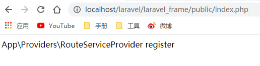
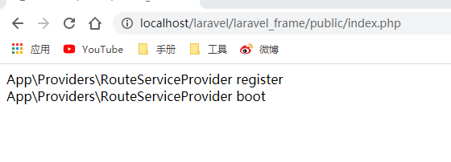

# Route服务提供者及route加载
## 1. 实现服务提供者注册(以RouteServiceProvider为例)
需先了解下``kernel``注册过程(上一张分析过)
``Kernel 文件：laravelstar\src\Foundation\Http\Kernel.php``
````
/**
 * 保存驱动类
 */
protected $bootstrappers = [
    \LaravelStar\Foundation\Bootstrap\RegisterFacades::class,
    \LaravelStar\Foundation\Bootstrap\LoadConfiguration::class,
    \LaravelStar\Foundation\Bootstrap\RegisterProviders::class,

];
````
写入 RegisterProviders 类，运行时以启动该类,``laravelstar\src\Foundation\Bootstrap\RegisterProviders.php ``
````
<?php
namespace LaravelStar\Foundation\Bootstrap;

use LaravelStar\Foundation\Application;

class RegisterProviders{

    public function bootstrap(Application $app)
    {
        //根据配置记录注册服务提供者
        $app->registerConfiguredProviders();
    }
}
````
RegisterProviders 类实现 根据配置记录注册服务提供者；调用 Application 中的
registerConfiguredProviders 方法。``laravelstar\src\Foundation\Application.php``
````
-------------------------------------------源码中写法-------------------------------------------
public function registerConfiguredProviders()
    {
        $providers = Collection::make($this->config['app.providers'])
                        ->partition(function ($provider) {
                            return strpos($provider, 'Illuminate\\') === 0;
                        });

        $providers->splice(1, 0, [$this->make(PackageManifest::class)->providers()]);

        (new ProviderRepository($this, new Filesystem, $this->getCachedServicesPath()))
                    ->load($providers->collapse()->toArray());
    }
-------------------------------------------我们的写法-------------------------------------------
    //记录服务提供者
    protected $serviceProviders;
    public function registerConfiguredProviders()
    {
        // 获取配置文件中的 服务提供者
        $privoders = $this->make('config')->get('app.provider');
        // 调用服务提供者对象中的load方法注册
        (new ProviderRegister($this))->load($privoders);
    }
    
    public function marASRegistered($provider)
    {
        $this->serviceProviders[] = $provider;
    }
````
读取配置文件并且通过 ProviderRegister 对象调用 load 方法加载服务提供者。补充进入app 文件：``frame\config\app.php ``
````
<?php
return [
    'provider' => [
        \App\Providers\RouteServiceProvider::class,
        //...
    ]
];
````
app 配置文件中注册 路由服务提供者ProviderRegister 文件：``laravelstar\src\Foundation\ProviderRegister.php``类似于源码中``src/Illuminate/Foundation/ProviderRepository.php``
````
----------------------------------------------------知识补充----------------------------------------------------

property_exists主要作用是判断类或对象中的属性是否存在

<?php
 
class myClass {
    public $mine;
    private $xpto;
    static protected $test;
 
    static function test() {
        var_dump(property_exists('myClass', 'xpto')); //true
    }
}
 
var_dump(property_exists('myClass', 'mine'));   //true
var_dump(property_exists(new myClass, 'mine')); //true
var_dump(property_exists('myClass', 'xpto'));   //true, as of PHP 5.3.0
var_dump(property_exists('myClass', 'bar'));    //false
var_dump(property_exists('myClass', 'test'));   //true, as of PHP 5.3.0
----------------------------------------------------代码内容----------------------------------------------------
<?php
/**
 * Create By: Will Yin
 * Date: 2020/8/2
 * Time: 14:44
 **/
namespace LaravelStar\Foundation;

class ProviderRegister
{
    protected $app;
    public function __construct(Application $app)
    {
        $this->app = $app;
    }
    //加载服务提供者
    public function load($providers)
    {
        foreach ($providers as $key => $provider) {
            $this->register($provider);
        }
    }

    //注册服务提供者
    protected function register($provider)
    {
        // 解析服务提供者的方法
        if (\is_string($provider)) {
            $provider = $this->resolveProvider($provider);
        }
        // 执行服务提供者的注册方法
        $provider->register();
        // 判断是否存在 bindings/singletons 这两个属性，如果有就进行容器注册
        if (property_exists($provider, 'bindings')) {
            foreach ($provider->bindings as $key => $value) {
                $this->app->bind($key, $value);
            }
        }
        if (property_exists($provider, 'singletons')) {
            foreach ($provider->singletons as $key => $value) {
                $this->app->singleton($key, $value);
            }
        }
        // 保存解析的服务提供者
        $this->app->marASRegistered($provider);
    }
    //解析服务提供者的方法
    protected function resolveProvider($provider)
    {
        return new $provider($this->app);
    }
}
````
> load 服务提供者加载方法的实现，循环遍历注册 配置文件中 写入的服务提供者并保存解析的服务提供
 者

服务提供者文件,ServiceProvider 文件 ：``laravelstar\src\Support\ServiceProvider.php``
````
<?php
/**
 * Create By: Will Yin
 * Date: 2020/8/2
 * Time: 14:32
 **/
namespace LaravelStar\Support;
use LaravelStar\Foundation\Application;

abstract class ServiceProvider
{
    protected $app;
    public function __construct(Application $app = null)
    {
        $this->app = $app;
    }
    public function register()
    {
    }
    public function boot()
    {
    }
}
````
服务提供者基类，主要提供 $app 和 register，boot 方法。
RouteServiceProvider 文件：``laravel_frame\app\Providers\RouteServiceProvider.php`` ：
````
<?php
/**
 * Create By: Will Yin
 * Date: 2020/8/2
 * Time: 14:29
 **/
namespace App\Providers;
use LaravelStar\Support\Facades\Route;
use LaravelStar\Support\ServiceProvider;

class RouteServiceProvider extends ServiceProvider
{
    protected $namespace = 'App\Http\Controller';
    public function register()
    {
        echo "App\Providers\RouteServiceProvider register<br>";
    }
    public function boot()
    {
        echo "App\Providers\RouteServiceProvider boot<br>";
    }
}
````


此时只是启动了``register``方法

开启``boot``方法,加入``\LaravelStar\Foundation\Bootstrap\BootProviders``启动类,源码位置``src/Illuminate/Foundation/Bootstrap/BootProviders.php``,
Kernel 文件： ``laravelstar\src\Foundation\Http\Kernel.php``：
````
-----------------------------------------------源码写法-----------------------------------------------
protected $bootstrappers = [
        \Illuminate\Foundation\Bootstrap\LoadEnvironmentVariables::class,
        \Illuminate\Foundation\Bootstrap\LoadConfiguration::class,
        \Illuminate\Foundation\Bootstrap\HandleExceptions::class,
        \Illuminate\Foundation\Bootstrap\RegisterFacades::class,
        \Illuminate\Foundation\Bootstrap\RegisterProviders::class,
        \Illuminate\Foundation\Bootstrap\BootProviders::class,
    ];
-----------------------------------------------我们的写法-----------------------------------------------
//因为是先执行所有的Register再执行所有的Boot方法,所以顺序不能错

 protected $bootstrappers = [
        \LaravelStar\Foundation\Bootstrap\RegisterFacades::class,
        \LaravelStar\Foundation\Bootstrap\LoadConfiguration::class,
        \LaravelStar\Foundation\Bootstrap\RegisterProviders::class,
         \LaravelStar\Foundation\Bootstrap\BootProviders::class,

    ];
````
写入 BootProviders 类，运行时以启动该类。
BootProviders 文件：``laravelstar\src\Foundation\Bootstrap\BootProviders.php``
````
<?php
/**
 * Create By: Will Yin
 * Date: 2020/8/2
 * Time: 14:48
 **/
namespace LaravelStar\Foundation\Bootstrap;
use LaravelStar\Foundation\Application;

class BootProviders
{
    public function bootstrap(Application $app)
    {
        $app->boot();
    }
}

````
Bootstrap 类 引导给定的应用程序；调用 Application 中的 boot 方法。
``laravelstar\src\Foundation\Application.php``
````
//这里就是一个开关的作用,记录是否启动了所有容器的boot方法
protected boot = false;

public function boot()
{
    // 对于应用来说事先执行
    if ($this->booted) {
        return ;
    }
    foreach ($this->serviceProviders as $key => $provider) {
        if (\method_exists($provider, 'boot')) {
            $provider->boot();
        }
    }
    //这里
    $this->booted = true;
}
````

## 2. Larave 框架 route 注册分析
````
# app\Providers\RouteServiceProvider.php
RouteServiceProvider 中 boot 方法的执行，调用父类的 boot 方法(Illuminate\Foundation\Support\Providers\RouteServiceProvider.php)

-》boot 方法调用 loadRoutes 方法实现加载应用程序路由，首先判断是否存在map方法(app\Providers\RouteServiceProvider.php)，有则执行

        protected function loadRoutes()
        {
            if (method_exists($this, 'map')) {
                $this->app->call([$this, 'map']);
            }
        }

-》执行 map 方法，会执行其中调用的 mapXxxRoutes 方法；(app\Providers\RouteServiceProvider.php)
     public function map()
        {
            $this->mapApiRoutes();
    
            $this->mapWebRoutes();
        }
    
-》mapXxxRoutes 方法最后执行
group[Illuminate\Routing\RouteRegistrar.php] 方法，该方法调用 group 方法；
    public function group($callback)
    {
        $this->router->group($this->attributes, $callback);
    }

-》group 方法调用 loadRoutes(Illuminate\Routing\Router.php)方法，
    protected function loadRoutes($routes)
    {
        if ($routes instanceof Closure) {
            $routes($this);
        } else {
            (new RouteFileRegistrar($this))->register($routes);
        }
    }
-》loadRoutes方法创建 RouteFileRegistrar 对象调用 register(Illuminate\Routing\RouteFileRegistrar.php) 方法
    public function register($routes)
    {
        $router = $this->router;
        
        require $routes;
    }

-》register 方法中获取文件地址，引入相关文件(Illuminate\Foundation\Support\Providers\RouteServiceProvider.php)

当调用get方法的时候，会执行 __call 方法，并调用 Illuminate\Routing\Router.php 中对应的方法；
    public function __call($method, $parameters)
    {
        if (static::hasMacro($method)) {
            return $this->macroCall($method, $parameters);
        }
        
        if ($method === 'middleware') {
            return (new RouteRegistrar($this))->attribute($method, is_array($parameters[0]) ? $parameters[0] : $parameters);
        }
        
        return (new RouteRegistrar($this))->attribute($method, $parameters[0]);
    }

-》get 方法为例，调用 addRoute 方法将相关信息存入 $routes 属性中。
    protected $routes;
    public function addRoute($methods, $uri, $action)
    {
        return $this->routes->add($this->createRoute($methods, $uri, $action));
    }

通过 RouteServiceProvider 中的 boot 启动，最终引入对应的路由文件，最终将路由的相关信息保存进$routes 属

    public function boot()
    {
        $this->setRootControllerNamespace();
        
        if ($this->routesAreCached()) {
         $this->loadCachedRoutes();
        } else {
            $this->loadRoutes();
        
            $this->app->booted(function () {
                $this->app['router']->getRoutes()->refreshNameLookups();
                $this->app['router']->getRoutes()->refreshActionLookups();
            });
        }
    }
````
## 3. route注册
````
<?php
namespace App\Providers;
use LaravelStar\Support\Facades\Route;
use LaravelStar\Support\ServiceProvider;

class RouteServiceProvider extends ServiceProvider
{
    protected $namespace = 'App\Http\Controller';
    public function register()
    {
        echo "App\Providers\RouteServiceProvider register<br>";
    }
    public function boot()
    {
        Route::namespace($this->namespace)->register($this->app->getBasePath().'/routes/route.php');

    }
}
````
路由服务提供者，调用 Route 类中的 namespace方法赋值 $namespace 属性， 调用 register 方法引入 ``laravel_frame\routes\route.php`` 下的路由文件
````

````
路由实现类，提供一个 getRoutes 方法做测试，最后用到。Route文件：``laravel_frame\routes\route.php``
````
<?php
use LaravelStar\Support\Facades\Route;

Route::get('index','IndexController@index');
````
> ``laravel_frame\routes\route.php`` 下的路由文件，通过静态方式调用 Route 类中的 get 方法，该方法会将当前的标识和地址通过调用 addRoute 方法保存到 $routes 属性中

Route 文件：frame\vendor\shineyork\laravelstar\src\Support\Facades\Route.php
````
<?php
namespace LaravelStar\Support\Facades;

class Route extends Facade{

    protected static function getFacadeAccessor()
    {
        return "route";
        //return \LaravelStar\Databases\Mysql::class;
    }
}
````
路由门面类。 Application 文件：``laravelstar\src\Foundation\Application.php``
````
public function registerCoreContainerAliases()
    {
        $bind = [
            'config' => \LaravelStar\Config\Config::class,
            'cookie' => \LaravelStar\Cookie\Cookie::class,
            'db' => \LaravelStar\Databases\Mysql::class,
            'or' => \LaravelStar\Databases\Oracle::class,
            'route' => \LaravelStar\Router\Route::class,
        ];
          foreach ( $bind as $key => $val){
            $this->bind($key,$val);
          }
      }
````
绑定 route 别名到 LaravelStar\Router\Route 类,RouteServiceProvider 文件：frame\app\Providers\RouteServiceProvider.php
````
public function register()
{
$this->app->instance('route', $this->app->make('route'));
}
````
路由服务提供者注册绑定。到此结束
## 4.请求的分发
对于Request请求做不同的分发处理,完善``laravel_frame/app/Providers/RouteServiceProvider.php``
````
<?php
/**
 * Create By: Will Yin
 * Date: 2020/8/2
 * Time: 14:29
 **/
namespace App\Providers;
use LaravelStar\Support\Facades\Route;
use LaravelStar\Support\ServiceProvider;

class RouteServiceProvider extends ServiceProvider
{
    protected $namespace = 'App\Http\Controller';
    public function register()
    {
        //注册时将路由设置为共享实例,使其解析完成
        $this->app->instance('route', $this->app->make('route'));
    }
    public function boot()
    {
        Route::namespace($this->namespace)->register($this->app->getBasePath().'/routes/route.php');

    }
}
````
这里我们加入dd到助手函数中``laravelstar/src/Support/helpers.php``,方便我们后期调试
````
if (! function_exists('dd')) {
    /**
     * 应用程序的助手函数 dd
     */
    function dd($message, $description = null)
    {
        if(!empty($description)){
            echo "======>>> ".$description." start\n";
            if (\is_array($message)) {
                echo \var_export($message, true);
            } else if (\is_string($message)) {
                echo $message."\n";
            } else {
                var_dump($message);
            }
            echo  "======>>> ".$description." end\n";
        } else {
            if (\is_array($message)) {
                echo json_encode($message);
            } else if (\is_string($message)) {
                echo $message."\n";
            } else {
                var_dump($message);
            }
        }
        exit;
    }
}
````
创建请求类``laravelstar/src/Request/Request.php``
````
<?php
namespace LaravelStar\Request;

class Request
{
    protected $method;

    protected $uriPath;

    public function getMethod()
    {
        return $this->method;
    }

    public function getUriPath()
    {
        return $this->uriPath;
    }
    /**
     * 初始化request
     */
    public static function capture()
    {
        $newRequest = self::createBase();

        $newRequest->method = $_SERVER['REQUEST_METHOD'];
        // 目前没做index.php 隐藏
        $newRequest->uriPath = $_SERVER['PATH_INFO'];

        //请求的方法 http://localhost/laravel/laravel_frame/public/index.php/index
        // 打印结果 /index
         //dd($_SERVER['PATH_INFO']);
        return $newRequest;
    }

    public function getPathInfo()
    {
        // ... 自行完善
        // explode($_SERVER['REQUEST_METHOD']);
    }

    public static function createBase()
    {
        return new static();
    }
}


Laravel中时通过symfony组件事情的请求分发处理(vendor\symfony\http-foundation\Request.php)
    //获取请求的路径信息
    public function getPathInfo()
    {
        if (null === $this->pathInfo) {
            $this->pathInfo = $this->preparePathInfo();
        }
        
        return $this->pathInfo;
    }
    //获取请求的路径信息的具体处理方法
    protected function preparePathInfo()
    {
        if (null === ($requestUri = $this->getRequestUri())) {
            return '/';
        }
        
        // Remove the query string from REQUEST_URI
        if (false !== $pos = strpos($requestUri, '?')) {
            $requestUri = substr($requestUri, 0, $pos);
        }
        if ('' !== $requestUri && '/' !== $requestUri[0]) {
            $requestUri = '/'.$requestUri;
        }
        
        if (null === ($baseUrl = $this->getBaseUrl())) {
            return $requestUri;
        }
        
        $pathInfo = substr($requestUri, \strlen($baseUrl));
            if (false === $pathInfo || '' === $pathInfo) {
            // If substr() returns false then PATH_INFO is set to an empty string
            return '/';
        }
        
        return (string) $pathInfo;
    }

    //对请求信息更为具体的处理
    public static function create($uri, $method = 'GET', $parameters = [], $cookies = [], $files = [], $server = [], $content = null)
        {
            $server = array_replace([
                'SERVER_NAME' => 'localhost',
                'SERVER_PORT' => 80,
                'HTTP_HOST' => 'localhost',
                'HTTP_USER_AGENT' => 'Symfony',
                'HTTP_ACCEPT' => 'text/html,application/xhtml+xml,application/xml;q=0.9,*/*;q=0.8',
                'HTTP_ACCEPT_LANGUAGE' => 'en-us,en;q=0.5',
                'HTTP_ACCEPT_CHARSET' => 'ISO-8859-1,utf-8;q=0.7,*;q=0.7',
                'REMOTE_ADDR' => '127.0.0.1',
                'SCRIPT_NAME' => '',
                'SCRIPT_FILENAME' => '',
                'SERVER_PROTOCOL' => 'HTTP/1.1',
                'REQUEST_TIME' => time(),
            ], $server);
    
            $server['PATH_INFO'] = '';
            $server['REQUEST_METHOD'] = strtoupper($method);
    
            $components = parse_url($uri);
            if (isset($components['host'])) {
                $server['SERVER_NAME'] = $components['host'];
                $server['HTTP_HOST'] = $components['host'];
            }
    
            if (isset($components['scheme'])) {
                if ('https' === $components['scheme']) {
                    $server['HTTPS'] = 'on';
                    $server['SERVER_PORT'] = 443;
                } else {
                    unset($server['HTTPS']);
                    $server['SERVER_PORT'] = 80;
                }
            }
    
            if (isset($components['port'])) {
                $server['SERVER_PORT'] = $components['port'];
                $server['HTTP_HOST'] .= ':'.$components['port'];
            }
    
            if (isset($components['user'])) {
                $server['PHP_AUTH_USER'] = $components['user'];
            }
    
            if (isset($components['pass'])) {
                $server['PHP_AUTH_PW'] = $components['pass'];
            }
    
            if (!isset($components['path'])) {
                $components['path'] = '/';
            }
    
            switch (strtoupper($method)) {
                case 'POST':
                case 'PUT':
                case 'DELETE':
                    if (!isset($server['CONTENT_TYPE'])) {
                        $server['CONTENT_TYPE'] = 'application/x-www-form-urlencoded';
                    }
                    // no break
                case 'PATCH':
                    $request = $parameters;
                    $query = [];
                    break;
                default:
                    $request = [];
                    $query = $parameters;
                    break;
            }
    
            $queryString = '';
            if (isset($components['query'])) {
                parse_str(html_entity_decode($components['query']), $qs);
    
                if ($query) {
                    $query = array_replace($qs, $query);
                    $queryString = http_build_query($query, '', '&');
                } else {
                    $query = $qs;
                    $queryString = $components['query'];
                }
            } elseif ($query) {
                $queryString = http_build_query($query, '', '&');
            }
    
            $server['REQUEST_URI'] = $components['path'].('' !== $queryString ? '?'.$queryString : '');
            $server['QUERY_STRING'] = $queryString;
    
            return self::createRequestFromFactory($query, $request, [], $cookies, $files, $server, $content);
        }
````
再``laravel_frame/public/index.php``中进行请求的处理
````
----------------------------------------------源码的写法----------------------------------------------
<?php
define('LARAVEL_START', microtime(true));

require __DIR__.'/../vendor/autoload.php';

$app = require_once __DIR__.'/../bootstrap/app.php';

$kernel = $app->make(Illuminate\Contracts\Http\Kernel::class);

$response = $kernel->handle(
    $request = Illuminate\Http\Request::capture()
);

$response->send();

$kernel->terminate($request, $response);
----------------------------------------------我们的的写法(这里还没进行请求的分发处理及响应处理)----------------------------------------------
<?php
/**
 * Create By: Will Yin
 * Date: 2020/7/31
 * Time: 21:32
 **/
require __DIR__.'/../vendor/autoload.php';

use LaravelStar\Foundation\Application;

$app = new Application($_ENV['APP_BASE_PATH'] ?? dirname(__DIR__));


// 处理http请求的
$app->singleton(
    \LaravelStar\Contracts\Http\Kernel::class,
    \App\Http\Kernel::class
);
$kernel = $app->make(\LaravelStar\Contracts\Http\Kernel::class, [$app]);
$response = $kernel->handle(
    //对于路由请求的响应
    \LaravelStar\Request\Request::capture()
);
````
关于路由的解析在``src/Illuminate/Routing/RouteCollection.php``
````
 public function match(Request $request)
    {
        $routes = $this->get($request->getMethod());

        $route = $this->matchAgainstRoutes($routes, $request);

        if (! is_null($route)) {
            return $route->bind($request);
        }

        $others = $this->checkForAlternateVerbs($request);

        if (count($others) > 0) {
            return $this->getRouteForMethods($request, $others);
        }

        throw new NotFoundHttpException;
    }

        protected function matchAgainstRoutes(array $routes, $request, $includingMethod = true)
        {
            [$fallbacks, $routes] = collect($routes)->partition(function ($route) {
                return $route->isFallback;
            });
            
            return $routes->merge($fallbacks)->first(function ($value) use ($request, $includingMethod) {
                return $value->matches($request, $includingMethod);
            });
        }
````
最终会调用到src/Illuminate/Routing/Matching/UriValidator.php
````
<?php
namespace Illuminate\Routing\Matching;
use Illuminate\Http\Request;
use Illuminate\Routing\Route;

class UriValidator implements ValidatorInterface
{
    public function matches(Route $route, Request $request)
    {
        $path = $request->path() === '/' ? '/' : '/'.$request->path();

        return preg_match($route->getCompiled()->getRegex(), rawurldecode($path));
    }
}
````
