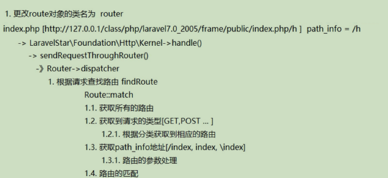
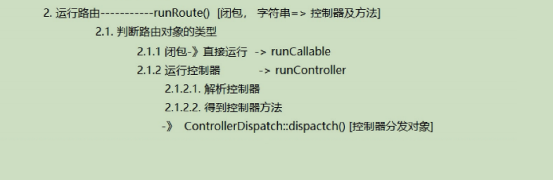
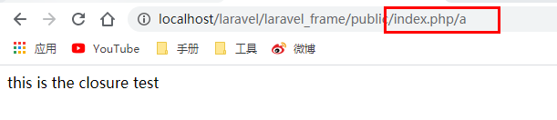
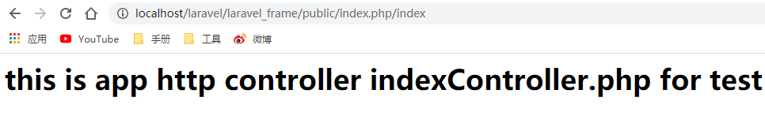

# 实现路由的请求分发
## 1.Route的解析过程


## 2.实现路由匹配
路由文件: ``laravel_frame\routes\route.php``
````
<?php
use LaravelStar\Support\Facades\Route;

Route::get('index','IndexController@index');
Route::get('a',function (){
     echo "this is the closure test";
});
````
kernel文件``laravel_frame/app/Http/Kernel.php``
````
<?php
/**
 * Create By: Will Yin
 * Date: 2020/7/31
 * Time: 21:15
 **/
namespace LaravelStar\Foundation\Http;

use LaravelStar\Contracts\Http\Kernel as Contracts;
use LaravelStar\Foundation\Application;
use LaravelStar\Request\Request;

// 处理http请求的核心对象
class Kernel implements Contracts
{
    /**
     * [protected description]
     * @var \LaravelStar\Foundation\Application
     */
    protected $app;
    /**
     * 保存驱动类
     */
    protected $bootstrappers = [
        \LaravelStar\Foundation\Bootstrap\RegisterFacades::class,
        \LaravelStar\Foundation\Bootstrap\LoadConfiguration::class,
        \LaravelStar\Foundation\Bootstrap\RegisterProviders::class,
        \LaravelStar\Foundation\Bootstrap\BootProviders::class,

    ];

    public function __construct(Application $app = null)
    {
        $this->app = $app;
    }

    public function handle(Request $request)
    {
        $this->sendRequestThroughRouter($request);
    }
    public function sendRequestThroughRouter(Request $request)
    {
        $this->bootstrap();
    }
    /**
     * 加载框架的驱动方法
     */
    public function bootstrap()
    {
        foreach ($this->bootstrappers as $bootstrapper) {
            $this->app->make($bootstrapper)->bootstrap($this->app);
        }
    }
}
````
handle 方法调用 sendRequestThroughRouter 方法 解析 route 对象并调用其中的 dispatch 方法。

Application 文件：``laravelstar/src/Foundation/Application.php``
````
 public function registerCoreContainerAliases()
    {
        $bind = [
            'config' => \LaravelStar\Config\Config::class,
            'cookie' => \LaravelStar\Cookie\Cookie::class,
            'db' => \LaravelStar\Databases\Mysql::class,
            'or' => \LaravelStar\Databases\Oracle::class,
            'route' => \LaravelStar\Router\Route::class,
        ];
          foreach ( $bind as $key => $val){
            $this->bind($key,$val);
          }
      }
````
从上述内容找到 route 对应的类为 ``laravelstar/src/Router/Router.php``；
````
<?php
/**
 * Create By: Will Yin
 * Date: 2020/8/2
 * Time: 21:30
 **/
namespace LaravelStar\Router;

class Router{
    /**
     * 路由本质实现是会有一个容器在存储解析之后的路由
     */
    protected $routes = [];

    protected $namespace;

    /**
     * 定义了访问的类型
     */
    protected $verbs = ['GET', 'POST', 'PUT', 'PATCH', 'DELETE'];

    public function get($uri, $action)
    {
        $this->addRoute(['GET'], $uri, $action);
    }

    public function post($uri, $action)
    {
        $this->addRoute(['POST'], $uri, $action);
    }

    public function any($uri, $action)
    {$this->addRoute(self::$verbs, $uri, $action);
    }
    public function namespace($namespace)
    {
        $this->namespace = $namespace;
        return $this;
    }
    public function getRoutes()
    {
        return $this->routes;
    }

    /**
     * 添加路由
     * @param string $methods 请求类型
     * @param string $uri 路由标识
     * @param object $action 控制器方法 | 闭包
     */
    public function addRoute($methods, $uri, $action)
    {
        foreach ($methods as $method ) {
            $this->routes[$method][$uri] = $action;
        }
    }

    /**
     * 注册路由
     */
    public function register($routes)
    {
        require_once $routes;
    }

    //-------------------------------------处理路由请求-------------------------------------

    //路由的分发
    public function dispatch(Request $request)
    {
        // dd($this->routes);
        return $this->runRoute($request, $this->findRoute($request));
    }

    //路由的查找
    public function findRoute(Request $request)
    {
        $route = $this->route->match($request->getUriPath(), $request->getMethod());
        $this->app->instance(Route::class, $route);
        return $route;
    }
    //运行路由
    public function runRoute(Request $request,Route $route){}
}
````
运行该类中的 dispatch 方法，该方法首先调用 findRoute 方法查找路由；查找的方式是通过调用route 类中的 match 方法进行字符串匹配查找,route 文件：``laravelstar/src/Router/Route.php``
````
<?php
/**
 * Create By: Will Yin
 * Date: 2020/8/3
 * Time: 15:11
 **/
namespace LaravelStar\Router;
use LaravelStar\Request\Request;
use LaravelStar\Foundation\Application;

class Route
{

    protected $app;

    protected $namespace;

    public function __construct(Application $app = null)
    {
        $this->app = $app;
    }


    //路由校验
    public function match($path, $method)
    {
        $routes = $this->app->make('route')->getRoutes();
        // dd($routes[$method]);
        foreach ($routes[$method] as $uri => $route) {
            $uri = ($uri && substr($uri, 0, 1) != '/') ? "/" . $uri : $uri;
            // 字符串匹配 =》 路由标识匹配
            if ($path === $uri) {
                $this->action = $route;
                break;
            }
        }

        // dd($this->action);
        return $this;
    }
    public function namespace($namespace)
    {
        $this->namespace = $namespace;
    }
}
````
match 方法遍历 LaravelStar\Router\Router 中的 $routes 属性，获取到 key 并与传递过来的标识做对比，当匹配的时候返回 $routes 属性 key 所对应的 value ，也就是地址

请求类 ：``laravelstar/src/Request/Request.php``
````
<?php
namespace LaravelStar\Request;

class Request
{
    protected $method;

    protected $uriPath;

    public function getMethod()
    {
        return $this->method;
    }

    public function getUriPath()
    {
        return $this->uriPath;
    }
    /**
     * 初始化request
     */
    public static function capture()
    {
        $newRequest = self::createBase();

        $newRequest->method = $_SERVER['REQUEST_METHOD'];
        // 目前没做index.php 隐藏
        $newRequest->uriPath = $_SERVER['PATH_INFO'];

        //请求的方法 http://localhost/laravel/laravel_frame/public/index.php/index
        // 打印结果 /index
         //dd($_SERVER['PATH_INFO']);
        return $newRequest;
    }

    public function getPathInfo()
    {
        // ... 自行完善
        // explode($_SERVER['REQUEST_METHOD']);
    }

    public static function createBase()
    {
        return new static();
    }
}
````
## 3.实现路由匹配
路由大致分为两类
- 闭包型
````
Route::get('a',function (){
     echo "this is the closure test";
});
````
- Controller型
````
Route::get('index','IndexController@index');
````
### 3.1 实现闭包路由匹配
当路由匹配完成之后返回给 runRoute 方法做为参数使用


路由运行的添加 ：``路由运行的添加 ：laravelstar\src\Router\Router.php``
````
<?php
/**
 * Create By: Will Yin
 * Date: 2020/8/2
 * Time: 21:30
 **/
namespace LaravelStar\Router;
use LaravelStar\Foundation\Application;
use LaravelStar\Request\Request;

class Router{
    /**
     * 路由本质实现是会有一个容器在存储解析之后的路由
     */
    protected $routes = [];

    protected $namespace;

    /**
     * @var \LaravelStar\Foundation\Application
     */
    protected $app;

    protected $route;

    /**
     * 定义了访问的类型
     */
    protected $verbs = ['GET', 'POST', 'PUT', 'PATCH', 'DELETE'];

    public function __construct(Application $app = null)
    {
        $this->app = $app;
        $this->route = new Route($app);
    }

    public function get($uri, $action)
    {
        $this->addRoute(['GET'], $uri, $action);
    }

    public function post($uri, $action)
    {
        $this->addRoute(['POST'], $uri, $action);
    }

    public function any($uri, $action)
    {$this->addRoute(self::$verbs, $uri, $action);
    }
    public function namespace($namespace)
    {
        $this->namespace = $namespace;
        return $this;
    }
    public function getRoutes()
    {
        return $this->routes;
    }

    /**
     * 添加路由
     * @param string $methods 请求类型
     * @param string $uri 路由标识
     * @param object $action 控制器方法 | 闭包
     */
    public function addRoute($methods, $uri, $action)
    {
        foreach ($methods as $method ) {
            $this->routes[$method][$uri] = $action;
        }
    }

    /**
     * 注册路由
     */
    public function register($routes)
    {
        require_once $routes;
    }

    //-------------------------------------处理路由请求-------------------------------------

    //路由的分发
    public function dispatch(Request $request)
    {
         //dd($this->routes);
        return $this->runRoute($request, $this->findRoute($request));
    }

    //路由的查找
    public function findRoute(Request $request)
    {
        $route = $this->route->match($request->getUriPath(), $request->getMethod());
        $this->app->instance(Route::class,$route);
        return $route;
    }
    //运行路由
    public function runRoute(Request $request,Route $route){
        return $route->run($request);
    }
}
````
findRoute 方法返回的结果为 ``laravelstar/src/Router/Route.php`` 的对象并且传递给 runRoute 方法执行；调用 ``laravelstar/src/Router/Route.php`` 的 run 方法
````
<?php
/**
 * Create By: Will Yin
 * Date: 2020/8/3
 * Time: 15:11
 **/
namespace LaravelStar\Router;
use LaravelStar\Request\Request;
use LaravelStar\Foundation\Application;

class Route
{

    protected $app;

    protected $namespace;

    public function __construct(Application $app = null)
    {
        $this->app = $app;
    }


    //路由校验
    public function match($path, $method)
    {
        $routes = $this->app->make('route')->getRoutes();
        // dd($routes[$method]);
        foreach ($routes[$method] as $uri => $route) {
            $uri = ($uri && substr($uri, 0, 1) != '/') ? "/" . $uri : $uri;
            // 字符串匹配 =》 路由标识匹配
            if ($path === $uri) {
                $this->action = $route;
                break;
            }
        }

        //dd($this->action);
        return $this;
    }

    public function namespace($namespace)
    {
        $this->namespace = $namespace;
    }

    //运行方法
    public function run(Request $request)
    {
        try {
            if ($this->isControllerAciton()) {
                return ;
            }
            return $this->runCallable();
        } catch (\Exception $e) {
            throw new \Exception("代码运行异常".$e->getMessage(), 300);
        }
    }

    //判断是否为控制器
    protected function isControllerAciton()
    {
        return \is_string($this->action);
    }

    //判断是否为回调函数
    protected function runCallable()
    {
        $callable = $this->action;
        return $callable();
    }
}
````
这里注意调整``laravelstar/src/Foundation/Http/Kernel.php``及入口文件``laravel_frame/public/index.php``的输出
````
public function sendRequestThroughRouter(Request $request)
    {
        $this->bootstrap();

        //及时返回结果
        return $this->app->make('route')->dispatch($request);
    }
````
````
<?php
/**
 * Create By: Will Yin
 * Date: 2020/7/31
 * Time: 21:32
 **/
require __DIR__.'/../vendor/autoload.php';

use LaravelStar\Foundation\Application;

$app = new Application($_ENV['APP_BASE_PATH'] ?? dirname(__DIR__));


// 处理http请求的
$app->singleton(
    \LaravelStar\Contracts\Http\Kernel::class,
    \App\Http\Kernel::class
);
$kernel = $app->make(\LaravelStar\Contracts\Http\Kernel::class, [$app]);
$response = $kernel->handle(
    //对于路由请求的响应
    \LaravelStar\Request\Request::capture()
);

//及时输出结果
echo $response;
````
   
### 3.2 实现控制器路由匹配
Route 文件：``laravelstar/src/Router/Route.php``
````
//----------------------------------------运行控制器----------------------------------------
    protected function runController()
    {
        return $this->controllerDispatcher()->dispatcher(
            $this, $this->getController(), $this->getControllerMethod()
        );
        // 1. 根据地址去创建控制器对象
        // 2. 执行
    }

    /**
     * 控制器分发对象
     */
    protected function controllerDispatcher()
    {
        return new ControllerDispatcher($this->app);
    }

    /**
     * 创建控制器
     */
    protected function getController()
    {
        if (! $this->controller) {

            $class = $this->namespace.'\\'.$this->parseControllerCallback()[0];

           //dd($class);
        // 为什么选择容器创建
        // 容器中存在反射类 -》 通过反射可以完成依赖注入
            $this->controller = $this->app->make(ltrim($class, '\\'));
        }
        return $this->controller;
    }

    /**
     * 根据路由地址处理控制器方法及方法名
     */
    protected function parseControllerCallback()
    {
        // $this->action => indexController @ index
        return explode('@', $this->action);
    }

    /**
     * 获取控制器的方法
     */
    protected function getControllerMethod()
    {
        return $this->parseControllerCallback()[1];
    }

    public function namespace($namespace)
    {
        $this->namespace = $namespace;
    }
````
run 方法中判断为字符串的时候执行 runController 方法，执行控制器中的方法需要先获取控制器和方法，分别通过 getController 方法和 getControllerMethod 方法实

getController 方法调用 parseControllerCallback 方法获取控制器名称并赋值给 $controller 属性。

getControllerMethod 方法调用 parseControllerCallback 方法获取方法名称； 通过ControllerDispatcher 类中的 dispatcher 方法执行对应的控制器中的方法。

ControllerDispatcher 文件：``laravelstar/src/Router/ControllerDispatcher.php``
````
<?php
/**
 * Create By: Will Yin
 * Date: 2020/8/4
 * Time: 9:18
 **/
namespace LaravelStar\Router;
use LaravelStar\Foundation\Application;


class  ControllerDispatcher
{
    protected $app;

    public function __construct(Application $app )
    {
        $this->app = $app;
    }
    /*
    * @param Route $route
    * @param string $controller 控制器的地址
    * @param string $method 控制住的方法
    * */
    public function dispatcher(Route $route, $controller, $method)
    {
        return $controller->{$method}();
    }
}
````
修改``laravelstar/src/Router/Router.php``中的namespace方法,为Route方法传递命名空间
````
<?php
/**
 * Create By: Will Yin
 * Date: 2020/8/2
 * Time: 21:30
 **/
namespace LaravelStar\Router;
use LaravelStar\Foundation\Application;
use LaravelStar\Request\Request;

class Router{
    /**
     * 路由本质实现是会有一个容器在存储解析之后的路由
     */
    protected $routes = [];

    protected $namespace;

    /**
     * @var \LaravelStar\Foundation\Application
     */
    protected $app;

    protected $route;

    /**
     * 定义了访问的类型
     */
    protected $verbs = ['GET', 'POST', 'PUT', 'PATCH', 'DELETE'];

    public function __construct(Application $app = null)
    {
        $this->app = $app;
        $this->route = new Route($app);
    }

    public function get($uri, $action)
    {
        $this->addRoute(['GET'], $uri, $action);
    }

    public function post($uri, $action)
    {
        $this->addRoute(['POST'], $uri, $action);
    }

    public function any($uri, $action)
    {
        $this->addRoute(self::$verbs, $uri, $action);
    }

    public function namespace($namespace)
    {
        $this->route->namespace($namespace) ;
        //dd($this->namespace);
        return $this;
    }


    public function getRoutes()
    {
        return $this->routes;
    }

    /**
     * 添加路由
     * @param string $methods 请求类型
     * @param string $uri 路由标识
     * @param object $action 控制器方法 | 闭包
     */
    public function addRoute($methods, $uri, $action)
    {
        foreach ($methods as $method ) {
            $this->routes[$method][$uri] = $action;
        }
    }

    /**
     * 注册路由
     */
    public function register($routes)
    {
        require_once $routes;
    }

    //-------------------------------------处理路由请求-------------------------------------

    //路由的分发
    public function dispatch(Request $request)
    {
         //dd($this->routes);
        return $this->runRoute($request, $this->findRoute($request));
    }

    //路由的查找
    public function findRoute(Request $request)
    {
        $route = $this->route->match($request->getUriPath(), $request->getMethod());
        $this->app->instance(Route::class,$route);
        return $route;
    }
    //运行路由
    public function runRoute(Request $request,Route $route){
        return $route->run($request);
    }

}
````

## 4. laravel 路由匹配原理
````
# 前面找到该方法的步骤省略(自行补充)
1) # Illuminate\Foundation\Http\Kernel.php
handle($request)
    -》$response = $this->sendRequestThroughRouter($request);# 通过路由器发送请求
        -》$this->dispatchToRouter() # 路由处理了 从着之下开始分发路由

2) # 路由处理
dispatchToRouter()
    -》$this->dispatchToRoute($request)
        # Illuminate\Routing\Router.php
        -》$this->runRoute($request, $this->findRoute($request)) # 查找和执行路由

3) # 查找路由 findRoute
findRoute($request)
    # 从 RouteCollection（由 Router::get('/', callback) 等设置的路由） 集合中查找与$request uri 相匹配的路由配置
    -》$this->current = $route = $this->routes->match($request);

4) # 运行路由 runRoute
runRoute(Request $request, Route $route)
    -》$this->runRouteWithinStack($route, $request)
        -》$route->run() # 判断并执行闭包或者执行控制器
            -》isControllerAction() # 判断是否为控制器
            -》runCallable() # 运行闭包
            -》runController() # 运行控制器方法
                -》controllerDispatcher() # 解析控制器，返回 ControllerDispatcher
    对象
                # Illuminate\Routing\ControllerDispatcher.php
                -》dispatch(Route $route, $controller, $method) # 控制器方法执行
                    -》getController() # 获取控制器
                        -》parseControllerCallback() #解析控制器
                    -》getControllerMethod() # 获取方法
    -》$this->prepareResponse() # 根据给定值创建响应实例
````

