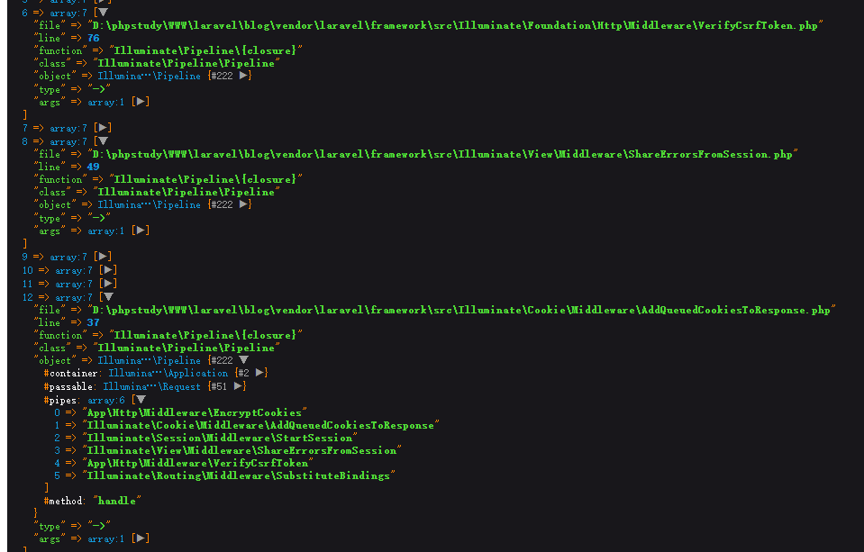
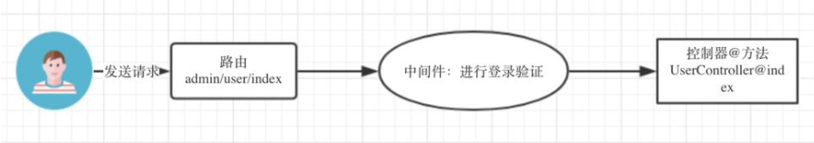
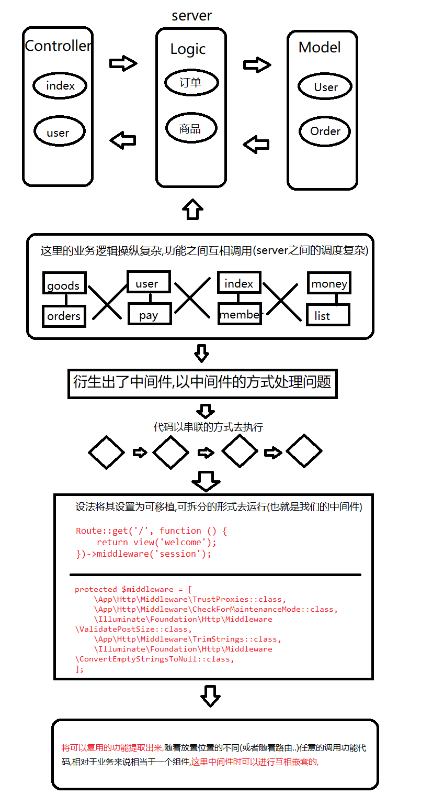
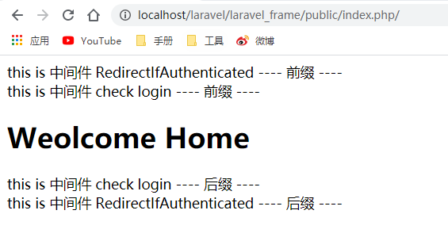

# 中间件的实现
## 1.理解中间件
Laravel 的中间件机制提供了一种管道的方式，每个 HTTP 请求经过一个又一个中间件进行过滤，Laravel 内置了很多中间件，比如 CSRF 机制，身份认证，Cookie 加密，设置 Cookie 等等(可以使用中间件实现日志的存储功能),在laravel中还有前置中间件，后置中间件的概念.

可以构造一个路由，并使用 debug_backtrace 函数来打印方法调用过程
````
Route::get('test',function(){
    dump(debug_backtrace());
});
````


这里 pipes 数组就是需要用到的中间件。
### 1.1 简单的中间件模型

### 1.2 理解中间件的由来

## 2.初步实现中间件
### 2.1 POP写法
````
echo (function(){
    return (function (){
        echo "先初始化 cookie<br>";

        echo (function (){
            echo "前置 -- Request2 <br>";

            echo (new Controller)->index();

            echo "后置 -- Request2<br>";
        })();

        echo "后置 -- 设置cookie和session  <br>";
    })();
})();

class Controller
{
    public function index()
    {
        echo "this is controller <br>";
    }
}
````
### 2.2 OOP写法
````
<?php
class Controller
{
    public function index()
    {
        echo "this is controller <br>";
    }
}
class cookie
{
    public static function hander(\Closure $next)
    {
        echo "先初始化 cookie <br>";
        $next();
        echo "后置 -- 设置cookie  <br>";
    }
}
class session
{
    public static function hander(\Closure $next)
    {
        echo "先初始化 session <br>";
        $next();
        echo "后置 -- session  <br>";
    }
}
class Request
{
    public static function hander(\Closure $next)
    {
        echo "前置 -- Request2<br>";
        $next();
        echo "后置 -- Request2<br>";
    }
}
$controller = function(){
    echo (new Controller)->index();
};

$request = function() use ($controller) {
    Request::hander($controller);
};
$session = function() use ($request) {
    session::hander($request);
};
cookie::hander($session);
````
## 3.实现pipeline
函数的补充array_reduce(),向用户自定义函数发送数组中的值，并返回一个字符串
- array_reduce : 会根据我们传递的数组, 会把数组每一个元素 会以递归的方式传递自定义的方法中
- $y 永远是递归之后执行的结果
- $r 是当前传递值
````
<?php
array_reduce($array, function ($y, $r){
    echo $y .' $y <br>';
    echo $r .' $r <br>';
    //$return = $y. "=> ".$r;
    //return $return;
    // var_dump($y);
},'l');
-------------------------------------------
结果:     
    l $y
    Dog $r
    $y
    Cat $r
    $y
    Horse $r
-------------------------------------------
$a=array("Dog","Cat","Horse");
$b = array_reduce($a, function ($y, $r){
    // echo $y .' $y <br>';
    //echo $r .' $r <br>';
    $return = $y. "=> ".$r;
    return $return;
});
var_dump($b);
-------------------------------------------
结果:string(20) "=> Dog=> Cat=> Horse"
````
````
function myfunction($y,$r)
{
    return $y+$r;
}
$a=array(10,15,20);
print_r(array_reduce($a,"myfunction",5));

结果:50
````
>array_reduce会将return的结果保存返回,这里对数组也有要求,只能处理 一维数组 对于二维以上的数组要进行单独的处理
````
--------------------------------------middleware.php--------------------------------------
<?php
// 扩展

class cookie
{
    public static function hander(\Closure $next)
    {
        echo "先初始化 cookie <br>";
        $next();
        echo "后置 -- 设置cookie  <br>";
    }
}
class session
{
    public static function hander(\Closure $next)
    {
        echo "先初始化 session <br>";
        $next();
        echo "后置 -- session  <br>";
    }
}
class Request
{
    public static function hander(\Closure $next)
    {
        echo "前置 -- Request2<br>";
        $next();
        echo "后置 -- Request2<br>";
    }
}
--------------------------------------Pipeline.php--------------------------------------
<?php
//引入中间价
require_once 'middleware.php';

//控制器部分
class Controller
{
    public function index()
    {
        echo "this is controller <br>";
    }
}

//管道部分,引入中间件并使用
class pipeline
{
    protected $pipes = [
        request::class,
        session::class,
        cookie::class,
    ];

    public function then(Closure $desctination)
    {
        $pipeline = array_reduce(
          $this->pipes(),
          $this->carry(),
          $desctination
        );
        // var_dump($pipeline);
        return $pipeline();
    }

    //获取 $pipes 属性
    public function pipes()
    {
        return $this->pipes;
    }

    //返回 array_reduce 所需要的第二个参数类型(闭包),对其进行处理
    public function carry()
    {
       //那么为什么这么书写呢?
       //简单看上去是 3次return  
        //我们最终的调用形式是这样的
            // (
            //     cookie::hander(
            //         session::hander(
            //             Request::hander(
            //               $controller
            //             )
            //         )
            //     )
            // )();
        return function($stack, $pipe){ 
            return function() use ($stack, $pipe){
                    echo $pipe."------<br>";
                    print_r($stack)."------<br>";
                    return $pipe::hander($stack);
                };
            };
            
    }
}

//将控制器内容修改成为闭包的形式,传递给then方法
$controller = function(){
    echo (new Controller)->index();
};

$p = new pipeline();
//传入闭包,$controller就是我们的初始值
$p->then($controller);
````
## 4.[框架中集成中间件](https://www.cnblogs.com/yulibostu/articles/10761829.html)
初步设置管道类``Pipeline.php``文件 : ``laravelstar/src/Pipeline/Pipeline.php``
````
<?php
namespace LaravelStar\Pipeline;

use LaravelStar\Foundation\Application;

class Pipeline{

    protected $app;

    protected $pipes = [
    ];

    /**
     * fun_name/fun_work:
     * @param
     * @param
     * @return
     */
    public function __construct(Application $app)
    {
        $this->app = $app;
     }

     //启动管道的方法
    public function then(Closure $desctination)
    {
        $pipeline = array_reduce(
            $this->pipes(),
            $this->carry(),
            $desctination
        );
        // var_dump($pipeline);
        return $pipeline();
    }

    //获取 中间件列
    public function pipes()
    {
        return $this->pipes;
    }

    //返回 array_reduce 所需要的第二个参数类型(闭包),对其进行处理
    public function carry()
    {
        //那么为什么这么书写呢?
        //简单看上去是 3次return
        return function($stack, $pipe){
            return function() use ($stack, $pipe){
                return $pipe::hander($stack);
            };
        };
    }
}
````
这里需要提供一个设置管道的方法,我们模仿源码的写法``src/Illuminate/Pipeline/Pipeline.php``
````
 public function through($pipes)
    {
        $this->pipes = is_array($pipes) ? $pipes : func_get_args();

        return $this;
    }

 public function send($passable)
    {
        $this->passable = $passable;

        return $this;
    }
````
进行我们的书写
````
<?php
/**
 * Create By: Will Yin
 * Date: 2020/8/4
 * Time: 21:11
 **/
namespace LaravelStar\Pipeline;

use LaravelStar\Foundation\Application;

class Pipeline{

    protected $app;

    protected $pipes = [
    ];

    //设置request或者其他需要的参数
    protected $passable;

    //设置闭包(中间件)默认的糊掉方法
    protected $method = 'handle';

    public function __construct(Application $app)
    {
        $this->app = $app;
     }

     //启动管道的方法
    public function then(Closure $desctination)
    {
        $pipeline = array_reduce(
            $this->pipes(),
            $this->carry(),
            $desctination
        );
        // var_dump($pipeline);
        return $pipeline();
    }

    //获取 中间件列
    public function pipes()
    {
        return $this->pipes;
    }

    //返回 array_reduce 所需要的第二个参数类型(闭包),对其进行处理
    public function carry()
    {
        //那么为什么这么书写呢?
        //简单看上去是 3次return
        return function($stack, $pipe){
            return function() use ($stack, $pipe){
                return $pipe::hander($stack);
            };
        };
    }

    public function through($pipes)
    {
                                                    //获取一个函数的所有参数
        $this->pipes = is_array($pipes) ? $pipes : func_get_args();

        return $this;
    }

    //管道中需要的参数,可以通过该方法发送至任意的管道中去
    public function send($passable)
    {
        $this->passable = $passable;

        return $this;
    }
}
````
设置中间件``laravel_frame/app/Http/Middleware/Login.php``
````
<?php
namespace App\Http\Middleware;
use Closure;

class Login
{
    public function handle($request, Closure $next)
    {
        echo "this is 中间件 check login ---- 前缀 ---- <br>";
        $response = $next($request);
        echo "this is 中间件 check login ---- 后缀 ---- <br>";
        return $response;
    }
}
````
注册中间件``laravel_frame/app/Http/Kernel.php``
````
<?php
namespace App\Http;

use LaravelStar\Foundation\Http\Kernel as HttpKernel;


class Kernel extends HttpKernel
{
    protected $middleware = [
        \App\Http\Middleware\Login::class,
        \App\Http\Middleware\RedirectIfAuthenticated::class,
    ];
}
````
在``LaravelStar\Foundation\Http\Kernel.php``中补充属性``protected $middleware``


那么在laravel中进行中间件调用的方式``src/Illuminate/Foundation/Http/Kernel.php``
````
 protected function sendRequestThroughRouter($request)
    {
        $this->app->instance('request', $request);

        Facade::clearResolvedInstance('request');

        $this->bootstrap();

        return (new Pipeline($this->app))
                    ->send($request)
                    ->through($this->app->shouldSkipMiddleware() ? [] : $this->middleware)
                    ->then($this->dispatchToRouter());
    }

protected function dispatchToRouter()
    {
        return function ($request) {
            $this->app->instance('request', $request);

            return $this->router->dispatch($request);
        };
    }
````
我们进行模仿直接修改我们的kernel文件``laravelstar/src/Foundation/Http/Kernel.php``
````
<?php
namespace LaravelStar\Foundation\Http;

use Illuminate\Routing\Pipeline;
use Illuminate\Support\Facades\Facade;
use LaravelStar\Contracts\Http\Kernel as Contracts;
use LaravelStar\Foundation\Application;
use LaravelStar\Request\Request;

// 处理http请求的核心对象
class Kernel implements Contracts
{
    /**
     * [protected description]
     * @var \LaravelStar\Foundation\Application
     */
    protected $app;
    /**
     * 保存驱动类
     */
    protected $bootstrappers = [
        \LaravelStar\Foundation\Bootstrap\RegisterFacades::class,
        \LaravelStar\Foundation\Bootstrap\LoadConfiguration::class,
        \LaravelStar\Foundation\Bootstrap\RegisterProviders::class,
        \LaravelStar\Foundation\Bootstrap\BootProviders::class,

    ];

    //中间件
    protected $middleware;

    public function __construct(Application $app = null)
    {
        $this->app = $app;
    }

    public function handle(Request $request)
    {
        $this->sendRequestThroughRouter($request);
    }

    // 进行路由的请求分发(包含中间件)
    public function sendRequestThroughRouter(Request $request)
    {
        $this->bootstrap();

        $this->app->instance('request', $request);

        return (new \LaravelStar\Pipeline\Pipeline($this->app))
            ->send($request)
            ->through($this->middleware)
            ->then($this->dispatchToRouter());
    }

    protected function dispatchToRouter()
    {
        return function ($request) {
            $this->app->instance('request', $request);
            return $this->router->dispatch($request);
        };
    }
    /**
     * 加载框架的驱动方法
     */
    public function bootstrap()
    {
        foreach ($this->bootstrappers as $bootstrapper) {
            $this->app->make($bootstrapper)->bootstrap($this->app);
        }
    }
}
````
那么这里运行会报错,因为我们注册的中间件中的方法不是静态的方法,那么怎么解决? 

仿照laravel的写法:``src/Illuminate/Foundation/Http/Kernel.php``
````
protected function carry()
     {
         return function ($stack, $pipe) {
             return function ($passable) use ($stack, $pipe) {
                 try {
                     if (is_callable($pipe)) {
                         
                         return $pipe($passable, $stack);
                     } elseif (! is_object($pipe)) {
                         [$name, $parameters] = $this->parsePipeString($pipe);

                         $pipe = $this->getContainer()->make($name);
 
                         $parameters = array_merge([$passable, $stack], $parameters);
                     } else {
                        
                         $parameters = [$passable, $stack];
                     }
 
                     $carry = method_exists($pipe, $this->method)? $pipe->{$this->method}(...$parameters) : $pipe(...$parameters);
 
                     return $this->handleCarry($carry);
                 } catch (Exception $e) {
                     return $this->handleException($passable, $e);
                 } catch (Throwable $e) {
                     return $this->handleException($passable, new FatalThrowableError($e));
                 }
             };
         };
     }

````
修改我们的``laravelstar/src/Foundation/Http/Kernel.php``
````
 public function carry()
    {
        return function ($stack, $pipe) {
            return function ($passable) use ($stack, $pipe) {
                try {
                    if (is_callable($pipe)) {
                        return $pipe($passable, $stack);
                    } elseif (! is_object($pipe)) {
                        $pipe = $this->app->make($pipe);
                        $parameters = [$passable, $stack];
                    }

                    return  method_exists($pipe, $this->method)
                        ? $pipe->{$this->method}(...$parameters)
                        : $pipe(...$parameters);

                } catch (Throwable $e) {
                }
            };
        };
        //那么为什么这么书写呢?
        //简单看上去是 3次return
        //return function($stack, $pipe){
        //return function() use ($stack, $pipe){
        //return $pipe::hander($stack);
        //};
        //};
    }
````
``laravelstar/src/Pipeline/Pipeline.php``完整内容
````
<?php
/**
 * Create By: Will Yin
 * Date: 2020/8/4
 * Time: 21:11
 **/
namespace LaravelStar\Pipeline;

use LaravelStar\Foundation\Application;

class Pipeline{

    protected $app;

    protected $pipes = [
    ];

    //设置request或者其他需要的参数
    protected $passable;

    //设置闭包(中间件)默认的糊掉方法
    protected $method = 'handle';

    public function __construct(Application $app)
    {
        $this->app = $app;
     }

     //启动管道的方法
    public function then(\Closure $desctination)
    {
        $pipeline = array_reduce(
            $this->pipes(),
            $this->carry(),
            $desctination
        );
        // var_dump($pipeline);
        return $pipeline($this->passable);
    }

    //获取 中间件列
    public function pipes()
    {
        return $this->pipes;
    }

    //返回 array_reduce 所需要的第二个参数类型(闭包),对其进行处理
    public function carry()
    {
        return function ($stack, $pipe) {
            return function ($passable) use ($stack, $pipe) {
                try {
                    if (is_callable($pipe)) {
                        return $pipe($passable, $stack);
                    } elseif (! is_object($pipe)) {
                        $pipe = $this->app->make($pipe);
                        $parameters = [$passable, $stack];
                    }

                    return  method_exists($pipe, $this->method)? $pipe->{$this->method}(...$parameters) : $pipe(...$parameters);
                } catch (Throwable $e) {

                }
            };
        };
        //那么为什么这么书写呢?
        //简单看上去是 3次return
        //return function($stack, $pipe){
        //return function() use ($stack, $pipe){
        //return $pipe::hander($stack);
        //};
        //};
    }

    public function through($pipes)
    {
                                                    //获取一个函数的所有参数
        $this->pipes = is_array($pipes) ? $pipes : func_get_args();

        return $this;
    }

    //管道中需要的参数,可以通过该方法发送至任意的管道中去
    public function send($passable)
    {
        $this->passable = $passable;

        return $this;
    }
}
````
``laravelstar/src/Foundation/Http/Kernel.php``完整内容
````
<?php
/**
 * Create By: Will Yin
 * Date: 2020/7/31
 * Time: 21:15
 **/
namespace LaravelStar\Foundation\Http;

use LaravelStar\Pipeline\Pipeline;
use LaravelStar\Contracts\Http\Kernel as Contracts;
use LaravelStar\Foundation\Application;
use LaravelStar\Request\Request;


// 处理http请求的核心对象
class Kernel implements Contracts
{
    /**
     * [protected description]
     * @var \LaravelStar\Foundation\Application
     */
    protected $app;
    /**
     * 保存驱动类
     */
    protected $bootstrappers = [
        \LaravelStar\Foundation\Bootstrap\RegisterFacades::class,
        \LaravelStar\Foundation\Bootstrap\LoadConfiguration::class,
        \LaravelStar\Foundation\Bootstrap\RegisterProviders::class,
        \LaravelStar\Foundation\Bootstrap\BootProviders::class,

    ];

    //中间件
    protected $middleware;

    public function __construct(Application $app = null)
    {
        $this->app = $app;
    }

    public function handle(Request $request)
    {
        $this->sendRequestThroughRouter($request);
    }

    // 进行路由的请求分发(包含中间件)
    public function sendRequestThroughRouter(Request $request)
    {
        $this->bootstrap();

        $this->app->instance('request', $request);

        return (new Pipeline($this->app))
            ->send($request)
            ->through($this->middleware)
            ->then($this->dispatchToRouter());
    }

    protected function dispatchToRouter()
    {
        return function ($request) {
            $this->app->instance('request', $request);

            return $this->app->make('route')->dispatch($request);
        };
    }
    /**
     * 加载框架的驱动方法
     */
    public function bootstrap()
    {
        foreach ($this->bootstrappers as $bootstrapper) {
            $this->app->make($bootstrapper)->bootstrap($this->app);
        }
    }
}
````

